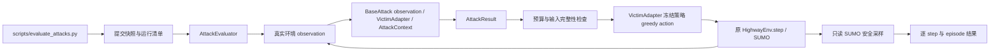

# Stage 2：适配器与统一评估

本阶段在现有 `rl_att/` 扩展。根目录 `main.py`、`oarl.py`、`Environment/`、`Data/` 和已有训练/checkpoint 验证入口保持原样。模型继续使用 `configs/frozen_victims.json` 的 10 个 episode-400 引用，不重新训练、选择或修改 checkpoint。

## 调用关系



原训练链不经过新评估器：`main.py → HighwayEnv → Agent/CleanVictimAgent → replay → train_model`。已有 `rl_att/checkpoint_evaluation.py` 继续作为独立等价参照。

## 接口约定

- `VictimAdapter` 校验 checkpoint 文件/权重哈希，使用 CPU、eval 模式和冻结参数。`probabilities(observation, input_grad=True)` 可对调用方传入的 requires_grad Tensor 求输入梯度；不启用参数梯度。当前 action 仅支持 greedy argmax。`assert_frozen()` 检查模式、参数开关及哈希。
- `BaseAttack(observation, victim, context) → AttackResult`。输入是原环境的 16D 归一化向量；不能修改传入 observation 或 victim。`AttackContext` 包含 run_seed、attack_seed、从 0 开始的 episode/step。
- `AttackResult` 包含 adversarial_observation、perturbation、attacked、attack_cost、metadata。扰动等于 adversarial−clean；不攻击时 observation 必须逐元素原样返回。`attacked` 表示执行了攻击，不要求非零扰动或动作改变。
- cost 记录 objective_evaluations、policy_forward_calls、wall_seconds；forward calls 指攻击自身调用，评估器的干净动作诊断与最终动作调用另计为每 step 两次。
- `AttackRegistry.defaults()` 在 Stage 2 注册 `none`、`oarl_bo`；Stage 3 增加 `random`、`fgsm`、`pgd`，预算和目标见 [STAGE3_PROTOCOL.md](STAGE3_PROTOCOL.md)。未知攻击、重复名字、未知配置字段和不支持的预算直接报错。后续新增攻击需显式扩展配置验证。
- 固定频率 `every_n_steps=N` 在每个 episode 的 step 0、N、2N… 执行；无状态筛选、无 Gate。

## OARL BO 的两个入口

`OARLBOAttack.search_batch(actor, prob, prob_next, obs1, obs2, attack_seed)` 使用轻量 `_BOBridge`，直接调用原 `Agent.get_optimal_perturb_Bayes` 和 `Agent.js_d_loss`，只采集候选参数与 objective。没有构造 replay、critic、优化器或新随机网络。返回原 JS Tensor、获胜参数、trace；保留 autograd、候选顺序、重复候选兼容、float64 JS 分支及被丢弃的 Categorical 采样。调用方拥有 RNG。测试把它接入一次完整原训练更新，逐 Tensor 比较 actor、critic、target、dual 及 Torch/NumPy RNG。原训练入口本身未替换。

在线 `__call__` 无法获得尚未执行动作的真实下一观测，明确使用 `obs2=obs1`、`prob_next=prob`，因此目标为 **2 × JS(π(s), π(u1·s+u2))**。这是原 BO 在单观测评估上的适配，不能声称等价于 replay 当前/下一状态的联合训练目标。没有查询未来 SUMO state。

搜索仍为 u1∈[0.8,1.2]、u2∈[−0.05,0.05]、UCB(kappa=1,xi=0.1)，默认 5 次 objective。每次攻击使用 run 的 attack_seed 重新初始化 BO；原方法中不使用的 Torch 采样放入独立、同 seed 的临时 RNG 流，不推进环境/策略 RNG。每次攻击 1 次 clean forward + 2×5 次扰动 forward；正常在线总计 11 次。trace 包含每次实际搜索目标与获胜参数。

预算是 **affine_box**，不是固定 epsilon 的 L∞ 球。所有 16 个分量共享 u1/u2；实测扰动范数仍记录，理论逐特征上界为 `0.2*abs(s_i)+0.05`（另含 float32 舍入误差）。没有投影、裁剪或物理特征屏蔽；lane、缺失邻车编码等也可能被改变。若后续需要与 FGSM/PGD 比较，必须另行声明预算匹配方案，不能把该 affine box 标成 epsilon=0.2。

## 执行与验证

在当前已提交、干净的仓库执行，脚本使用训练时已固定的本地 Python/PyTorch/SUMO 环境：

```powershell
python scripts/evaluate_attacks.py --config configs/evaluation/no_attack_equivalence.json
python scripts/evaluate_attacks.py --config configs/evaluation/oarl_bo_adapter_smoke.json
```

第一项对两个 victim×5 seeds×20 held-out episodes 验证 NoAttack 与旧评估的 return、steps、termination、collision、action counts、SUMO seed、逐轨迹 SHA 完全一致。第二项为两个 victim 的 seed 0、各 2×20 steps 的 none/BO 接线检查，不是 Stage 3 攻击性能 benchmark。

每个运行在 `.local/runs/<timestamp>-attack-evaluation/` 保存 Git SHA、完整配置、启动命令、运行时、源文件哈希、模型引用、各组有效角色 seed；训练/评估 SUMO seed 直接复用 `seed_manifest`。保存 `evaluation.json`、逐组 `summary.json`/`episodes.json`/`steps.jsonl` 和 stdout/stderr。源码来自 Git 快照；只有快照中的 SUMO seed XML 允许按原 reset 行为变化。原 checkpoint 始终只读引用。

安全口径见 [SAFETY_METRICS.md](SAFETY_METRICS.md)。上述 Stage 2 验证保持历史记录；Stage 3 的 Random、FGSM、PGD 和完整 benchmark 单独记录于 [STAGE3_PROTOCOL.md](STAGE3_PROTOCOL.md)。没有接入 Zero-One 或 Ours。
