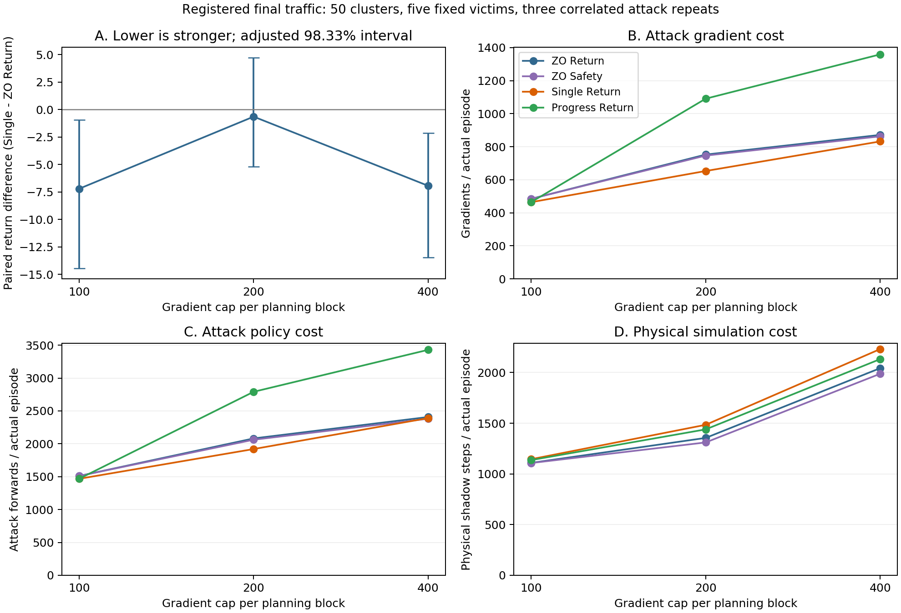

# Single Return：最终固定交通测试结果与论文主张

2026-10-04。完整重跑的 **12 批 / 14,500 个原始 episode / 2,217,831 个真实交互步**全部通过逐批审计，17 行完整比较表生成成功。低、高预算的 Single 相对预算版 Zero-One Return 的回报差及三预算调整区间均为负；中预算证据不足。中、高预算相对 Progress 省去约四成梯度，但增加仿真开销。当前证据适合推进限定范围的攻击论文初稿，不支持全面优势、效果等价或稳定跨预算安全优势。

方法定义：[ATTACK_METHOD_FREEZE.md](ATTACK_METHOD_FREEZE.md)。预登记：[ATTACK_FINAL_TEST_PROTOCOL.md](ATTACK_FINAL_TEST_PROTOCOL.md)。重跑授权与偏离：[ATTACK_FINAL_FULL_RESTART.md](ATTACK_FINAL_FULL_RESTART.md)。机器摘要：[ATTACK_FINAL_RESULTS.json](ATTACK_FINAL_RESULTS.json)。原 split-20 候选结果保持历史记录，不被本轮覆盖。

## 执行来源和完整性

- 方法冻结 SHA：`d218309627830be924c48ef7fd9d984be11da247`；本轮实际执行 SHA：`bfe42d65a47493f66b7329e2328390814108617b`。运行期间 main 的 tracked tree 保持干净。运行完成后才创建 `codex/final-attack-results` 结果分支，没有修改攻击、原 OARL、环境、模型、预算或种子。
- 用户授权对中断矩阵完整重跑。本轮于 2026-10-04 13:58:44–19:49:36（Asia/Shanghai）运行；只本轮完整数据进入统计。旧尝试保留，未合并部分结果，未再次重跑或挑选更有利结果。并发耗时约 5 小时 51 分，不能当作方法间速度差。
- split 30 的 50 个交通 seed 与开发/验证集合分离，但旧尝试已暴露它们；完整重跑不是第二个新的独立交通样本。算法和超参数未因最终结果改变，这项协议偏离必须进入论文。
- 五个 frozen Clean episode-400 模型，Normal/Pn=0.14、greedy_argmax、16D、三动作、最多 200 步，attack seed 0/1/2，无 Gate。相同交通与扰动盒 `|delta_i| <= 0.2|obs_i|+0.05`；沿用既有每特征 `2e-7` 数值审计容差，不对结果事后裁剪。
- Python 3.7.16、Torch 1.3.1+cpu（单线程）、NumPy 1.21.6、SciPy 1.7.3、sklearn 0.24.2、SUMO 1.22.0；Windows 主机版本探测原值为 `Windows-10-10.0.26100-SP0`。完整 pip/版本/角色 seed 和五模型哈希在 preflight、manifest 和机器摘要中保存。五个 checkpoint 的文件哈希在本次分析时再次核验，全部一致。
- 运行前完整就绪证书记录 164 项测试通过、1100 条已有 episode / 182593 步 fixture 复核；本轮又完成全部 14,500 episode 的实际 SUMO/观测/动作/完整候选/首次共享证据/Progress 停止规则/预算/真实成本审计。全部重复 Clean 完整轨迹回归通过。
- 14,500 = 11,500 个攻击 + 3,000 个 Clean。比较表展示其中 11,750 条实际记录；Clean 只有 250 个唯一模型/交通对，额外 2750 条仅作回归。FGSM 只有 250 个实际 episode，确定性配对广播不扩充成本或样本数。统计单位是 50 个交通聚类，条件于五个固定模型；三个 attack seed 是相关重复。
- 完整输出：`.local/runs/20261004-final-attack-full-restart/final-comparison.json`，SHA-256 `b7f24feff1ba804e09cd7bfdec641248d91f9c3a8da8050d3c828479514fb998`。顶层 `final-attack.json` 与 12 个 audit 的路径/哈希、启动命令和原始来源均可追溯；raw、日志和轨迹继续保存在 `.local/`。

## 完整效果表

Return 越低表示回报损害越大；Drop = 同交通 Clean Return − 攻击 Return。碰撞沿用 SUMO/minGap 定义，不保证实际几何接触。ASR 只计配对 Clean 未碰撞之后的攻击碰撞转换。Clean 唯一碰撞 26/250，攻击分母通常为 672=224×3，FGSM 为 224。

| 方法 | 梯度/forward 上限每块 | 实际 episode | Return | Drop | 碰撞/实际 episode | ASR 成功/eligible | ASR |
| --- | --- | ---: | ---: | ---: | --- | --- | ---: |
| Clean | 固定 | 250 | 142.816 | 0.000 | 26/250 (10.40%) | — | — |
| Random | 固定 | 750 | 144.532 | -1.716 | 71/750 (9.47%) | 10/672 | 1.49% |
| FGSM | 固定 | 250 | 106.121 | 36.695 | 76/250 (30.40%) | 57/224 | 25.45% |
| PGD | 固定 | 750 | 105.897 | 36.919 | 238/750 (31.73%) | 177/672 | 26.34% |
| OARL-BO | 固定 | 750 | 145.432 | -2.616 | 62/750 (8.27%) | 1/672 | 0.15% |
| Zero-One Return | 低 100/200 | 750 | 115.586 | 27.230 | 210/750 (28.00%) | 137/672 | 20.39% |
| Zero-One Safety | 低 100/200 | 750 | 115.575 | 27.241 | 210/750 (28.00%) | 137/672 | 20.39% |
| Single Return | 低 100/200 | 750 | 108.381 | 34.435 | 239/750 (31.87%) | 167/672 | 24.85% |
| Progress Return | 低 100/200 | 750 | 108.380 | 34.436 | 239/750 (31.87%) | 167/672 | 24.85% |
| Zero-One Return | 中 200/400 | 750 | 103.993 | 38.823 | 268/750 (35.73%) | 192/672 | 28.57% |
| Zero-One Safety | 中 200/400 | 750 | 103.370 | 39.446 | 272/750 (36.27%) | 194/672 | 28.87% |
| Single Return | 中 200/400 | 750 | 103.346 | 39.470 | 268/750 (35.73%) | 190/672 | 28.27% |
| Progress Return | 中 200/400 | 750 | 103.224 | 39.592 | 268/750 (35.73%) | 191/672 | 28.42% |
| Zero-One Return | 高 400/800 | 750 | 102.615 | 40.201 | 274/750 (36.53%) | 196/672 | 29.17% |
| Zero-One Safety | 高 400/800 | 750 | 102.194 | 40.622 | 275/750 (36.67%) | 197/672 | 29.32% |
| Single Return | 高 400/800 | 750 | 95.679 | 47.137 | 297/750 (39.60%) | 222/672 | 33.04% |
| Progress Return | 高 400/800 | 750 | 96.726 | 46.090 | 296/750 (39.47%) | 223/672 | 33.18% |

Random 和 OARL-BO 在本轮没有造成平均回报损害，甚至均值略高于 Clean；它们仍完整报告。OARL-BO 是原 BO 目标的独立评估适配，不等价于原 OARL 的鲁棒训练及其 robust victim，不能据此宣布原论文方法无效。

## RQ1：与同预算 Zero-One Return 比较

每模型/交通先平均三个攻击 seed，再等权平均五模型；对 50 个共同交通 block bootstrap 10,000 次，seed=20261004。下表三预算调整区间为预登记约 98.3333% percentile 区间，仅条件于这五个模型。

| 每块梯度上限 | Single−ZO Return | 95% 描述区间 | 三预算调整区间 | 模型均值胜/平/负 | 交通均值胜/平/负 | 移除一个交通后 Return 差范围 |
| ---: | ---: | --- | --- | --- | --- | --- |
| 100 | -7.205704 | [-12.998, -1.915] | [-14.450, -0.953] | 5/0/0 | 35/0/15 | [-8.013, -5.430] |
| 200 | -0.647552 | [-4.471, 3.721] | [-5.199, 4.729] | 3/0/2 | 35/0/15 | [-2.101, 0.218] |
| 400 | -6.936490 | [-12.027, -2.737] | [-13.459, -2.145] | 5/0/0 | 40/0/10 | [-7.292, -5.324] |

**低、高预算有方向一致的回报证据，中预算只保留很小的负均值。** 中档 checkpoint 2/3 的差分别为 +2.354/+0.189，移除一个交通可让整体差变成 +0.218；不能写“三档稳定优于 ZO”。低/高档五个模型均值都为负，分别 35/50、40/50 个交通均值更低，优势并非仅来自 checkpoint 2。逐模型/交通存在负例，完整数据仍在原 JSON。

| 梯度上限 | Single 独有转换等效单位 | ZO 独有 | 净转换 | 移除任一交通后的净转换范围 |
| ---: | ---: | ---: | ---: | --- |
| 100 | 15.000 | 5.000 | +10.000 | [7.667, 11.000] |
| 200 | 6.667 | 7.333 | -0.667 | [-2.333, 2.000] |
| 400 | 11.000 | 2.333 | +8.667 | [6.000, 9.000] |

转换是把三个相关攻击平均到 224 个 eligible 模型/交通对后的等效单位，允许分数；不是独立碰撞次数或安全置信区间。低/高档本轮净转换改善，且移除任一单独交通仍为正，比旧验证的单交通集中性有所改善；中档仍净损失，未做跨预算安全显著性保证，也不支持跨场景安全优势。Zero-One Safety 是不同目标补充：Single 的三档 Return 差为 −7.194/−0.024/−6.515，不能替代匹配 Return 的主比较。

## RQ2：省去重试后的模型计算与仿真取舍

| Single−Progress | Return 差 | 95% 描述区间 | 梯度变化/episode | 攻击 forward 变化/episode | physical shadow 变化/episode | 净转换等效单位 |
| --- | ---: | --- | ---: | ---: | ---: | ---: |
| 100 | +0.000882 | [-0.000, 0.003] | -0.15% | -0.06% | +0.77% | +0.000 |
| 200 | +0.121931 | [-0.347, 0.652] | -40.12% | -31.20% | +3.13% | -0.333 |
| 400 | -1.047323 | [-3.469, 0.780] | -38.77% | -30.28% | +4.65% | -0.333 |

中、高档梯度分别少 40.12%/38.77%，攻击 forward 少 31.20%/30.28%，physical shadow 多 3.13%/4.65%；低档几乎没有模型计算节省。三个 Return 描述区间都跨零，未预设非劣界限，所以不能声明效果等价或无损省算。最终测试中中/高档 Single 各少一个有效碰撞转换，旧验证“全部碰撞逐对一致”不再适用于本轮；高档 Single 总碰撞 297 比 Progress 296 高，并不矛盾，因为 Clean 已碰撞样本不能计入 ASR。

相对 Zero-One Return，Single 的三档梯度少 4.21%/13.21%/4.54%，攻击 forward 少 2.85%/7.77%/0.71%，physical shadow **增加 3.28%/9.54%/9.22%**。因此可谈模型计算分配，不可谈全面计算优势或总体速度更快。每真实步成本也完整保留，避免提前终止的 per-episode 分母影响被隐藏。

## RQ3：轨迹搜索是否优于简单攻击

| 梯度上限 | Single−FGSM Return | 95% 描述区间 | Single−PGD Return | 95% 描述区间 |
| ---: | ---: | --- | ---: | --- |
| 100 | +2.259 | [-4.232, 8.746] | +2.483 | [-4.109, 9.069] |
| 200 | -2.775 | [-8.812, 3.057] | -2.552 | [-8.727, 3.400] |
| 400 | -10.442 | [-18.434, -3.717] | -10.218 | [-18.248, -3.453] |

高档搜索的额外回报损害较明确，分别比 FGSM/PGD 低 10.442/10.218；ASR 33.04% 对比 25.45%/26.34%，净转换 +17/+15 等效单位。低档 Single 回报反而更高，中档描述区间跨零。补充区间不作全体比较的多重显著性保证。

FGSM 每 episode 只有 147.59 次梯度、295.18 次攻击 forward、零 shadow；高档 Single 为 832.25/2390.31/2231.06，存在显著额外开销和仿真权限。PGD 则为 1466.99/1760.38/0，Single 梯度虽更少，forward 和仿真更多。不能笼统说搜索值得所有情况下的代价；当前更明确的适用条件是允许仿真且使用高档预算。所有简单攻击维持固定配置，没有强制填满搜索预算。

## 实际成本完整表

均为每实际 episode 的均值。梯度/攻击 forward 与评估循环分开；physical shadow 包含新 transition、历史 replay、reset warmup、setup；不含真实环境步。上限是每规划块而非 episode 总额。完整各项总量及每真实步值见机器摘要，wall time 受并发影响，不混合成任意加权效率分数。

| 方法 | 梯度档 | 梯度 | 攻击 forward | 评估 forward | 总 forward | 新 shadow transition | physical shadow |
| --- | --- | ---: | ---: | ---: | ---: | ---: | ---: |
| Clean | 固定 | 0.00 | 0.00 | 365.26 | 365.26 | 0.00 | 0.00 |
| Random | 固定 | 0.00 | 0.00 | 367.70 | 367.70 | 0.00 | 0.00 |
| FGSM | 固定 | 147.59 | 295.18 | 295.18 | 590.35 | 0.00 | 0.00 |
| PGD | 固定 | 1466.99 | 1760.38 | 293.40 | 2053.78 | 0.00 | 0.00 |
| OARL-BO | 固定 | 0.00 | 2043.57 | 371.56 | 2415.12 | 0.00 | 0.00 |
| Zero-One Return | 低 100/200 | 484.98 | 1510.91 | 300.26 | 1811.16 | 194.60 | 1108.87 |
| Zero-One Safety | 低 100/200 | 484.82 | 1510.36 | 300.20 | 1810.55 | 194.50 | 1107.38 |
| Single Return | 低 100/200 | 464.56 | 1467.92 | 289.43 | 1757.35 | 197.35 | 1145.29 |
| Progress Return | 低 100/200 | 465.25 | 1468.85 | 289.42 | 1758.27 | 197.07 | 1136.52 |
| Zero-One Return | 中 200/400 | 752.71 | 2081.61 | 272.46 | 2354.08 | 221.71 | 1354.99 |
| Zero-One Safety | 中 200/400 | 746.61 | 2061.61 | 270.46 | 2332.07 | 218.19 | 1310.45 |
| Single Return | 中 200/400 | 653.30 | 1919.94 | 273.75 | 2193.70 | 240.25 | 1484.28 |
| Progress Return | 中 200/400 | 1091.01 | 2790.67 | 273.52 | 3064.19 | 238.42 | 1439.27 |
| Zero-One Return | 高 400/800 | 871.81 | 2407.32 | 269.73 | 2677.05 | 270.62 | 2042.73 |
| Zero-One Safety | 高 400/800 | 863.10 | 2380.96 | 268.22 | 2649.18 | 266.29 | 1987.51 |
| Single Return | 高 400/800 | 832.25 | 2390.31 | 257.05 | 2647.35 | 306.30 | 2231.06 |
| Progress Return | 高 400/800 | 1359.25 | 3428.67 | 257.62 | 3686.29 | 297.41 | 2132.03 |

图 A 为预登记主比较及约 98.3333% 条件区间；B–D 为真实成本均值。三次攻击先平均，不当作独立交通；D 包含 setup/replay；图不展示总体速度或跨模型总体区间。

## 模型差异与安全指标边界

| checkpoint training seed | Clean 碰撞/50 | 高档 Zero-One Return 碰撞/150 | 高档 Single 碰撞/150 | 高档 Single−ZO Return |
| ---: | ---: | ---: | ---: | ---: |
| 0 | 1 | 37 | 45 | -8.913 |
| 1 | 4 | 36 | 38 | -6.998 |
| 2 | 16 | 141 | 139 | -2.357 |
| 3 | 3 | 24 | 30 | -6.461 |
| 4 | 2 | 36 | 45 | -9.954 |

共同交通上 checkpoint 2 的 Clean 碰撞 16/50，另外四模型合计 10/200，说明这个固定模型在本测试集明显更脆弱；不把它推广为 training seed 的因果效应。高档 Single 在 checkpoint 2 的总碰撞比 ZO 少 2，其他模型合计多 25；回报优势覆盖五模型，不能只用 seed 2 代表方法。

TTC/DRAC 从真实 SUMO 同车道纵向 state 计算。完整 17 行有效分母和条件均值在 JSON；以下用于说明不同指标并不一致，而非额外安全主检验。

| 方法 | episode 最小 TTC 条件均值 / 有效数 | episode TTC p5 条件均值 | episode DRAC p95 条件均值 / 有效数 |
| --- | --- | ---: | --- |
| Clean  | 21.107 s / 170/250 | 26.624 s | 0.2390 m/s² / 242/250 |
| Zero-One Return 高档 | 17.685 s / 409/750 | 23.901 s | 0.1291 m/s² / 712/750 |
| Single Return 高档 | 16.313 s / 386/750 | 21.937 s | 0.1237 m/s² / 706/750 |

Single 高档碰撞更多、TTC 条件均值更低，但 DRAC p95 条件均值也更低，不能包装成全部安全指标恶化。非闭合 TTC 为 null，重叠 DRAC 不定义；提前终止、缺失和有效样本组成会影响这些条件汇总。平均 episode p5/p95 不是 pooled percentile，也不测量横向换道几何安全。

## 论文主张及下一步

可以开始攻击论文初稿，但投稿价值仍取决于完整相关工作核对、机制解释与写作，当前实验不保证新颖性或录用。正式候选继续为 Single Return，不根据 split 30 新选版本。

可支持的表述：**在原 SUMO 场景、五个冻结 Clean 策略与已预登记交通上，以实际动作证据组织有限预算行为搜索；低和高预算相对预算版 Zero-One Return 增加回报损害，中预算优势不确定。单次诱导相对重复诱导减少中高档模型计算，但增加仿真成本并存在效果损失案例。高档相对固定 FGSM/PGD 有额外损害，同时需要更高或不同维度的资源。**

贡献增量仍是实际行为分支的外层搜索组织及单次诱导的资源分配取舍。Zero-One 的外层序列优化已经存在，它也使用实际输出动作；PGD、实际历史缓存、oracle、保底和账本是共同机制，不能分别宣称为本方法独占创新。“目标未命中后的真实分支组织”不等于 Zero-One 忽略实际动作，也没有不可达性证明。既有相关工作边界见方法定稿，尚需投稿前专项新颖性审查。

不要写：三档都稳健超越、单次无损/等价、整体速度快约四成、所有成本更低、稳定安全或跨场景/跨策略优势、观测盒确保物理可实现。五模型固定，只有一个场景，未覆盖 PPO、其他场景或对防御的自适应攻击。

下一项应整理攻击论文初稿、方法伪代码及有利/不利轨迹解释，保留中档负证据；不继续在最终交通上堆模块或调参。之后再独立开展防御，先利用既有 OARL Robust Victim 作对照并重新生成针对该 victim 的攻击，按新预登记评估干净表现、受攻击表现和开销；本次没有启动防御、追加 SUMO、训练新模型或公开推送。

## 文件核验与重建

本摘要的 17 行、21 个配对 contrast 和模型汇总由完整 `final-comparison.json` 与 12 份已核验 group audit 派生，未加入原中断尝试。总 counts、source/audit 哈希、模型哈希、转换等效单位求和再次验证；论文所需逐 episode/traffic、预算 trace 与负例路径仍由原始来源追溯。

原始完整导出器为 `scripts/summarize_attack_final.py`，要求处于干净的实验执行 SHA `bfe42d6...` 再重建完整结果；不可在新主分支伪装成原实验 SHA。分析使用现有 pinned runtime，派生脚本和图表脚本在 `.local/` 保留；机器摘要记录分析脚本哈希，原始完整 JSON 是数值依据。结果文档、必要的小型 JSON 和图表可以入 Git，raw/checkpoint/log 继续忽略。结果核验完成后按独立 branch、Conventional Commit 和 `--no-ff` merge 规范集成；本次不创建 milestone tag。
