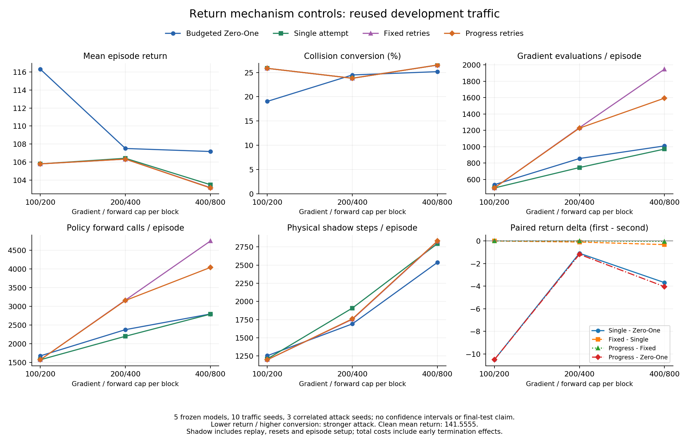

# 完整 Return 机制对照：开发集结果

2026-10-03。预登记九组实验全部完成：**2250 个 episode、369008 个实际交互步审计通过**。本轮只新增配置、启动、审计、汇总和报告工具，没有改变攻击算法、原 OARL、SUMO 环境、冻结 checkpoint 或 Zero-One 参考源码。

结果支持把现有贡献重点放在有限预算下的外层实际行为搜索组织。低档收益不依赖独立重试；中、高档重试的平均回报收益有限，没有增加碰撞转换。高档进展停止节省了固定重试的计算，但仍存在错过有效后续重启的反例。这些是已使用开发交通上的条件机制证据，不能替代新交通验证、证明单模块因果或确立文献首创。

## 范围、来源与验证

- 协议：[MECHANISM_DEVELOPMENT_PROTOCOL.md](MECHANISM_DEVELOPMENT_PROTOCOL.md)；完整配置清单：`configs/research/mechanism_development.json`。
- 五个第 400 episode 的 frozen Clean checkpoint × split 10 的十个交通 episode × attack seed 0/1/2 × 三档梯度/forward 上限 × 五个条件。45 个配置、九批各 250 episode，在运行前提交。
- 1800 个攻击 episode、450 个重复 Clean episode。每个预算/条件的 150 条记录来自 **50 个 model/traffic 单元、10 个交通 seed** 的重复攻击，不是 150 个独立交通样本。三个梯度/forward 上限一起改变，不作单一梯度预算的因果解释。
- 执行源码 commit：`4fda0927acb9e4c21d6455b3a4d29ade343e6ff7`；原始汇总 commit 相同。报告导出工具：`081296540a183b517d042be6d19d96485a53709c`。分支从 `main` 的 `5501e966279eca62344692d436cde17b24b5fe16` 创建，保留历史分支和实验源码。
- 管线记录：`.local/runs/20261003-mechanism-development/mechanism-development.json`，SHA256 `01307ab17aabf9056cd62111ca076a55f456ff313a9a0e1f1bbea65233f2969a`。完整汇总为同目录 `verified-summary.json`，SHA256 `79d163970fd5443b7ea670677bb5bb3391fc33a8b2e09a62be34c645bc0f2efe`。九批审计路径/哈希、五个 checkpoint 哈希、关键轨迹引用见 [MECHANISM_DEVELOPMENT_RESULTS.json](MECHANISM_DEVELOPMENT_RESULTS.json)。原始结果、模型和日志只在 `.local/`。
- 逐步核对有限的 16D 观测、扰动一致性和包络、实际动作、reward、终止、轨迹摘要、逐 episode 聚合、完整候选、计划执行、oracle 和多维预算；权重、有效 seed、运行源码及版本全部核对通过。270 个模型/方法配对中共同首次尝试的 seed、实际动作及 margin 一致。
- 九批 Clean 与既有十 episode Clean 共 **89748 步回归一致**，只排除 wall time 和未使用的 attack seed；400/800、attack seed 0 的五条件前两 episode 与 smoke 共 **8504 步一致**，只排除 wall time。没有排除动作、扰动或成本。
- Python 3.7.16、Torch 1.3.1+cpu（1 线程）、NumPy 1.21.6、SciPy 1.7.3、sklearn 0.24.2、Gym 0.15.4、SUMO 1.22.0；host `Windows-11-10.0.26200-SP0`。完整依赖、启动命令和角色 seed 仍在各运行 manifest。117 项单元测试在启动前通过，报告导出又从原审计输入重建并校验全部汇总；六面板图已渲染检查。
- 全程无 Gate；扰动仍为 `|delta_i| <= 0.2|observation_i| + 0.05`，horizon 20、每块最多十个搜索候选、PGD 每次两步，其他预算固定。本轮没有运行 split 20/30 或 Safety 新实验，没有开发防御。

Windows 协议工作副本与实验 commit 的 `git archive` 导出字节一致（CRLF），SHA256 为 `a35808e0fa2adfb758c15f174c0ed7189e31f2a24f57847ad4c6d0e764f8dc1a`。未因 `git show` 的 LF blob 差异修改协议或放宽原始文件哈希检查。

## 五个条件

| 简称 | 注册名称 | 作用 |
| --- | --- | --- |
| Clean | `none` | 原冻结策略，无观测攻击 |
| ZO | `zero_one_budgeted_return` | 同预算/PGD/oracle 的目标动作序列搜索，缓存首次尝试，无独立重试 |
| Single | `ours_single_return` | 原行为搜索单次尝试包装器，无独立重试 |
| Fixed | `ours_return` | 原行为搜索，节点/目标最多三次独立尝试 |
| Progress | `ours_progress_return` | 原行为搜索，保留第一次重试，后续根据最佳 margin 的严格进展停止 |

这是嵌套条件比较，不是完整 factorial。Single−ZO 比较搜索组织整体，包括目标选择、分支调度及排序；双方已共享缓存，不能把差异归因于缓存本身。Fixed−Single 检验行为搜索内允许重试的变化；Progress−Fixed 检验该搜索内进展停止的变化。原 `zero_one` 适配版的资源协议不同，本轮未混入。

## 回报与碰撞

每行 150 条相关记录；每档 Clean 均值 **141.555519**，碰撞 3/150，实际来自一个重复的 Clean 碰撞单元。新增碰撞 ASR 在 147 条配对 Clean 未碰撞记录中计算。SUMO 碰撞仍包含原 minGap 事件语义，不声称物理接触或完整横向风险覆盖。

| 梯度/forward 上限 | 条件 | 平均 Return | 碰撞 / 150 | 新增碰撞 / 147 | ASR |
| --- | --- | ---: | ---: | ---: | ---: |
| 100/200 | ZO | 116.308942 | 31 | 28 | 19.05% |
| 100/200 | Single | 105.797608 | 41 | 38 | 25.85% |
| 100/200 | Fixed | 105.797608 | 41 | 38 | 25.85% |
| 100/200 | Progress | 105.797608 | 41 | 38 | 25.85% |
| 200/400 | ZO | 107.508898 | 39 | 36 | 24.49% |
| 200/400 | Single | 106.421460 | 38 | 35 | 23.81% |
| 200/400 | Fixed | 106.328181 | 38 | 35 | 23.81% |
| 200/400 | Progress | 106.328184 | 38 | 35 | 23.81% |
| 400/800 | ZO | 107.172055 | 40 | 37 | 25.17% |
| 400/800 | Single | 103.486787 | 42 | 39 | 26.53% |
| 400/800 | Fixed | 103.164382 | 42 | 39 | 26.53% |
| 400/800 | Progress | 103.126897 | 42 | 39 | 26.53% |

## 嵌套比较与异质性

Return 差为 first−second，负值表示 first 的攻击更强；净转换差为双方独有新增碰撞的差。去一交通范围每次移除同一交通的全部五模型和三个攻击 seed，不是置信区间或显著性检验。轨迹相同按原 trajectory digest 核对，允许扰动/计划成本不同。

| 上限 | first−second | 平均 Return 差 | 净转换差 | 相同实际轨迹 / 150 | 梯度总差 | 去一交通 Return 差范围 |
| --- | --- | ---: | ---: | ---: | ---: | --- |
| 100/200 | Single−ZO | −10.511334 | +10 | 47 | −5982 | [−11.851358, −4.600350] |
| 100/200 | Fixed−Single | 0 | 0 | 150 | +72 | [0, 0] |
| 100/200 | Progress−Fixed | 0 | 0 | 150 | 0 | [0, 0] |
| 100/200 | Progress−ZO | −10.511334 | +10 | 47 | −5910 | [−11.851358, −4.600350] |
| 200/400 | Single−ZO | −1.087439 | −1 | 43 | −16600 | [−3.023460, +0.276798] |
| 200/400 | Fixed−Single | −0.093278 | 0 | 147 | +73164 | [−0.110371, +0.006728] |
| 200/400 | Progress−Fixed | +0.000003150 | 0 | 148 | −808 | [0, +0.000003500] |
| 200/400 | Progress−ZO | −1.180714 | −1 | 43 | +55756 | [−3.016732, +0.173159] |
| 400/800 | Single−ZO | −3.685268 | +2 | 44 | −5796 | [−4.307645, −2.756028] |
| 400/800 | Fixed−Single | −0.322405 | 0 | 111 | +146650 | [−0.394167, −0.060810] |
| 400/800 | Progress−Fixed | −0.037485 | 0 | 148 | −53212 | [−0.042391, +0.000741] |
| 400/800 | Progress−ZO | −4.045158 | +2 | 50 | +87642 | [−4.708203, −3.155166] |

低档 Single 和 Progress 相对 ZO：五个模型平均 Return 均更低，七个交通均值更低、三个更高；净新增碰撞 +10 为 first-only 11、second-only 1。其中七条重复同一 episode 3；去掉该交通后净差只剩 +3，不能把 +10 当成十个独立新场景收益。

中档 Single 和 Progress 各只在两个模型均值更低、三个更高；去掉单个交通可使总体 Return 差翻转。双方独有转换 2 对 3，不能声称稳定安全优势。高档 Progress 在五个模型均值均更低，但 checkpoint 0/3/4 的差仅 −0.002889/−0.038035/−0.002464；主要均值收益来自 checkpoint 1/2。高档净新增转换 +2 全来自 checkpoint 2 的 episode 5、9，去掉其中一个交通后只剩 +1。

| 上限 | 比较 | cp0 Return 差 | cp1 | cp2 | cp3 | cp4 |
| --- | --- | ---: | ---: | ---: | ---: | ---: |
| 100/200 | Single−ZO | −9.734247 | −14.920823 | −16.252089 | −3.780641 | −7.868870 |
| 200/400 | Single−ZO | +0.302452 | −6.495097 | +1.184180 | +0.031665 | −0.460394 |
| 400/800 | Single−ZO | +0.075773 | −5.349673 | −13.335114 | +0.033156 | +0.149518 |
| 100/200 | Progress−ZO | −9.734247 | −14.920823 | −16.252089 | −3.780641 | −7.868870 |
| 200/400 | Progress−ZO | +0.302452 | −6.464820 | +0.687528 | +0.031665 | −0.460394 |
| 400/800 | Progress−ZO | −0.002889 | −6.795307 | −13.387097 | −0.038035 | −0.002464 |

## 实际成本与重试收益

每行汇总 150 episode。Shadow 为规划实际物理步数，含新 transition、历史 replay 和规划 reset 预热；**每行攻击另有 12300 个 episode 初始 oracle setup 步**，图中已计入。并发 wall time 不用作速度比较。

| 上限 | 条件 | 梯度 | Forward | 新 shadow transition | 规划 shadow steps |
| --- | --- | ---: | ---: | ---: | ---: |
| 100/200 | ZO | 80222 | 250606 | 32403 | 175655 |
| 100/200 | Single | 74240 | 235045 | 31697 | 169101 |
| 100/200 | Fixed | 74312 | 235045 | 31611 | 167296 |
| 100/200 | Progress | 74312 | 235047 | 31618 | 167303 |
| 200/400 | ZO | 128288 | 355954 | 38470 | 241396 |
| 200/400 | Single | 111688 | 329410 | 41767 | 274055 |
| 200/400 | Fixed | 184852 | 474552 | 41180 | 250922 |
| 200/400 | Progress | 184044 | 473094 | 41261 | 251751 |
| 400/800 | ZO | 151444 | 418929 | 47634 | 368358 |
| 400/800 | Single | 145648 | 418255 | 53574 | 407092 |
| 400/800 | Fixed | 292298 | 712130 | 53724 | 411721 |
| 400/800 | Progress | 239086 | 605928 | 53908 | 412529 |

Single 三档总梯度均少于 ZO，但中、高档仿真成本更高；高档 forward 总量仅少 674 次。低档 Single 真实交互步为 23260，ZO 为 25097；梯度/实际步分别为 3.1917、3.1965，forward/实际步为 10.1051、9.9855。总成本下降部分伴随提前终止，不是独立效率因果证据。

Fixed 相对 Single：中档额外 73164 梯度（+65.51%），平均 Return 仅低 0.093278；高档额外 146650 梯度（+100.69%），平均 Return 仅低 0.322405，四个模型均值改善、一个退化。两档都没有新增碰撞。Progress 相对 Fixed 在高档减少 53212 梯度（18.20%）、106202 forward（14.91%），规划 shadow 反而增加 808 步。相对 Single，高档 Progress 的平均 Return 低 0.359891，碰撞转换相同，梯度多 93438 次；不能称为全面成本优势。

| 上限 | 条件 | 独立重试 | 重试发现新分支 | 新分支出现在选中计划 | 被进展规则抑制的目标 |
| --- | --- | ---: | ---: | ---: | ---: |
| 100/200 | Fixed | 146 | 2 | 0 | — |
| 100/200 | Progress | 136 | 2 | 0 | 10 |
| 200/400 | Fixed | 38019 | 7 | 1 | — |
| 200/400 | Progress | 37503 | 7 | 1 | 20892 |
| 400/800 | Fixed | 74186 | 17 | 4 | — |
| 400/800 | Progress | 47344 | 14 | 3 | 28342 |

“出现在选中计划”是轨迹中的发现归因，不证明其造成碰撞或回报改进；“抑制目标”也不是一对一节省次数，释放预算会改变后续搜索。低档 Fixed/Progress 与 Single 的全部实际轨迹一致，却有计划和仿真成本差异，表明不能把每次新发现都当成最终攻击收益。

Single 与 ZO 的累计独特完整动作序列数低/中/高分别为 1228/1880/2792 对 1300/1827/2693，独特前缀为 23848/33523/48006 对 25403/33089/43927。并非每档覆盖都增加；这些计数还受访问状态、规划块数和提前终止影响。低档 Single 完整候选重复占比约 4.51%，ZO 约 33.61%，但双方已有缓存，重复候选减少不等于同等比例的物理查询节省。所有条件 unplanned/live-unverified fallback 均为零；不完整候选没有伪装成完整低回报计划。



曲线只连接三个登记档位，不能当作连续预算插值；ASR 重合的三个行为搜索条件分别保留。未绘制独立样本置信区间。

## 正反轨迹与机制边界

机器摘要保留 24 个按三个攻击 seed 平均差值选出的正反 model/traffic 单元，及最大绝对差值的代表 seed、原始路径和首次 transition 分歧。下列步骤编号均从零开始。

- 低档 cp0 / episode 3 / attack seed 1：Single 首步动作 1、ZO 动作 2；前者一步碰撞，后者 200 步无碰撞，代表 Return 差 −145.734。该单元三个 seed 平均差 −97.156；这是已有高风险交通上的收益，不是普遍更危险的轨迹证明。
- 低档 cp1 / episode 8 / attack seed 1：同样首步动作 1 对 2，但双方都无碰撞，Single 代表 Return 反而高 37.621；单元平均差 +12.722。相同首次动作差异可以有不同后果，不能直接把动作 1 标成危险动作。
- 中档 cp2 / episode 9 / attack seed 2：Single 从第 1 步动作 2 对 ZO 动作 1 开始分歧，48 步碰撞对 200 步无碰撞，代表 Return 差 −101.642。反例 cp2 / episode 4：ZO 三个 seed 均在 29/31/29 步碰撞，Single 均 200 步无碰撞；该单元平均 Return 差 +98.902。Fixed 的两次回报改善没有补上这一安全差距。
- 高档 Fixed−Single 最大均值改善在 cp1 / episode 4（平均 −13.384），首次分歧第 1 步动作 1 对 2。分歧节点对目标 0 的三次尝试实际都为 2，不能把此改善声称为“重试成功诱导了动作 1”；预算与候选选择变化也参与结果。高档 cp2 / episode 9 则 Fixed 比 Single 平均 Return 高 3.689，保留重试退化案例。
- 高档 cp2 / episode 9 / attack seed 2：Progress−Fixed 首次分歧第 20 步，动作 2 对 1；双方都碰撞，分别 33 对 48 步，代表 Return 差 −5.723。高档 Progress−Fixed 总体微小均值改进主要集中在该交通，去掉 episode 9 后变为 +0.000741，不能声称稳定攻击收益。
- 高档 cp3 / episode 5 / attack seed 2：Progress 在第 196 步执行动作 2，Fixed 执行动作 1。目标 1 的 attempt 0/1 均实际输出 2、margin 同为 −0.00953078，Progress 停止；Fixed 的 attempt 2（seed 1616814779）输出 1，margin +0.00663149。双方 200 步无碰撞，Progress Return 高 0.1。这个真实反例表明 margin 停滞不证明动作不可诱导，不能把停止规则写成可达性结论。

## 方法定位与下一项功能

外层搜索的条件比较在低档给出了明确正结果，在高档也降低平均 Return；独立重试和进展规则主要表现为有限收益及成本取舍。可将论文机制主张收敛到实际行为分支组织与有限预算分配，并把重试/停止作为带负结果的条件消融。不能宣称所有模块必需、全面超过基线、稳定安全优势、物理可行性或文献首创。本轮仅 Return 条件，不能把重试效果外推到 Safety。

下一项功能建议在新的独立分支冻结 Single 作为简化候选，并在既有 validation split 20 对完整三档预算/模型/攻击种子复核，保留当前 Progress 和预算版 ZO 对照。split 20 已用于方法判断，必须明确这是验证驱动的候选修改，不能把它重新称为未见测试；只有候选和论文主张冻结后才计划 split 30。若暂不改最终方法，现有 Progress 的验证结果仍是主要依据。当前没有自动替换最终攻击、调参、加入 Gate 或启动防御。

既有完整简单攻击比较仍见 [VALIDATION_COMPARISON_RESULTS.md](VALIDATION_COMPARISON_RESULTS.md)，既有 Return/Safety 新交通结果见 [SHARED_COMPUTE_VALIDATION_RESULTS.md](SHARED_COMPUTE_VALIDATION_RESULTS.md)。本开发结果不能替代这些核心比较，也不能用不同交通上的 FGSM 与本表直接作差。

## 重建与 Git 集成

在冻结 legacy 环境中设置 `PATH` 的 runtime/Library/bin、`OMP_NUM_THREADS=1`、`MKL_NUM_THREADS=1` 和 `.local/` 内的 `MPLCONFIGDIR`，然后执行：

```powershell
E:/Programs/anaconda3/python.exe scripts/run_mechanism_development.py --output .local/runs/<new-directory>
.local/envs/oarl-legacy/python.exe scripts/summarize_mechanism_development.py --pipeline .local/runs/20261003-mechanism-development/mechanism-development.json --output .local/runs/20261003-mechanism-development/rebuilt-summary.json
.local/envs/oarl-legacy/python.exe scripts/export_mechanism_development.py --summary .local/runs/20261003-mechanism-development/verified-summary.json --output .local/runs/20261003-mechanism-development/rebuilt-results.json --figure .local/runs/20261003-mechanism-development/rebuilt-figure.png
```

重建输出使用新文件，保留原审计与哈希引用。汇总工具拒绝缺失/重复网格、不同模型/交通、被更改的 raw input 和未经验证批次；导出工具再次重建原汇总，只允许汇总代码自身 commit 字段不同。无需为合并再运行 2250 episode。

原子提交：`a27769f` 完整冻结网格；`774f61a` 完整逐步及回归审计；`c0da754` 冻结模型哈希核对；`0cebbad` 有界并发与失败记录；`4fda092` 按模型/交通聚类的机制汇总；`0812965` 报告和成本图导出。结果文档与小型摘要单独提交，完成验证后按 `AGENTS.md` 合入 `main`，历史分支保留。本轮不建立算法有效性 tag，不进行公开 push。
