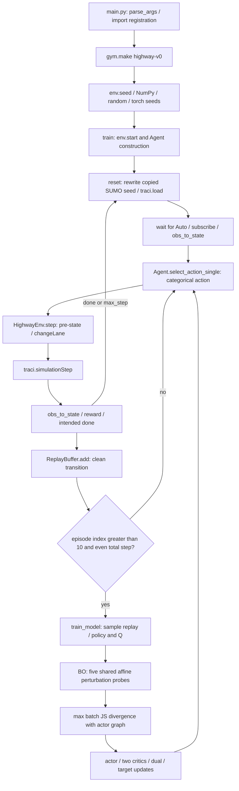

# OARL 源码审计：Stage 0 与 Stage 1 复现前置

审计日期：2026-09-12。对象为上游 `29e5c0e2497cd0bd27b6cf83c5bce800a3e2c54a`，本地冻结 tag 为 `upstream-oarl-29e5c0e2497c`。本文基于完整源码，以下行号均指冻结版本；运行证据另见 [BASELINE_RUNTIME_CHECKS.md](BASELINE_RUNTIME_CHECKS.md)。

**结论：原 Agent 是在 BO 策略敏感度惩罚下训练的 OARL Robust Victim。项目没有独立 Clean Victim、冻结 checkpoint 的攻击评估器、真实碰撞率或 TTC/DRAC 记录。当前默认 Python 不能直接运行；本轮保留算法，先验证依赖与短程调用链，不能据此宣称完成论文复现。**

## 1. 范围、文件清单与来源

本轮不接入 Zero-One，不建立新 Attack API，不开发 Ours，不改 observation/action/reward/BO 公式。`Zero-OneAttack-main` 只检查了目录和 Git 状态，未修改源码。

| 文件 | 职责 |
|---|---|
| `main.py`（159 行） | CLI、环境注册、种子、采样、训练触发、CSV、每 100 回合保存 actor |
| `oarl.py`（264 行） | ActorNet、CriticNet、ReplayBuffer、Agent、BO、actor/critic/dual/target 更新 |
| `Environment/environment/__init__.py` | Gym 注册 `highway-v0` |
| `Environment/environment/envs/__init__.py` | 导出 HighwayEnv |
| `Environment/environment/envs/highway_env.py`（483 行） | TraCI 生命周期、车辆观测、横向动作、奖励、终止 |
| `Environment/setup.py` | `highway_env` 0.0.1；只声明 gym 依赖 |
| `Data/StraightRoad.sumocfg` | SUMO 输入、seed、碰撞处置、换道参数 |
| `Data/StraightRoad.net.xml` | 单直道、4 条车道、路长/几何 |
| `Data/StraightRoad.rou.xml` | 车辆类型、概率流、Auto 车辆 |
| `requirements.txt` | 7 个直接依赖固定版本；无传递依赖锁定 |
| `README.md`、`framework.jpg` | 上游说明、论文引用、框架示意 |
| `Data/._*`（3 个） | 上游 macOS 元数据，不参与算法 |

全部 15 个上游文件已冻结；Git tree 与上游完全一致。SHA、逐文件 hash、原始环境、许可证与上传限制见 [UPSTREAM_PROVENANCE.md](UPSTREAM_PROVENANCE.md)、[UPSTREAM_PROVENANCE.json](UPSTREAM_PROVENANCE.json) 和 [ENVIRONMENT_AUDIT.json](ENVIRONMENT_AUDIT.json)。

## 2. 完整调用链



1. `main.py:1-36` 在模块顶层导入依赖、解析参数、建立 Gym 环境、设置 seed；即使 `--help` 也先导入依赖。`Environment.environment` 的 import 完成注册，entry point 指向 HighwayEnv。
2. `main.py:39-45` 调用 `env.start(gui=False)`，通过 TraCI 启动 SUMO；随后创建 Agent 并切换网络为 train 模式。环境模块顶层仍会解析 `sumo-gui` 路径，实际 start 使用无 GUI 的 `sumo`。
3. `reset()` 清理部分计数，读写 sumocfg、`traci.load`，推进到 Auto 出现，订阅所有车辆的 speed/position/lane index/distance，并给 Auto 设置 `laneChangeMode=0`；再推进一步返回 16D state。warm-up 不计入 RL step。
4. action 来自干净 state；`step()` 缓存动作前 `_findstate()`，发送换道请求，执行一次 SUMO step，生成下一 state，再计算 reward 和预期的 done。
5. replay 存储 `(s,a,r,s',done)`，没有把 BO 后的观测写回环境或 replay。
6. `n_epi > 10`（从零计数，即第 12 个 episode 开始），且全局 `interaction_times % 2 == 0` 才执行 `train_model()`。默认每回合 200 步，最早第 2202 次交互触发；没有独立的 `buffer.size >= batch_size` 门槛。
7. `train_model()` 从 replay 抽样，在 minibatch 当前/下一观测上搜索 BO 策略差异，并依次更新 actor、Q1、Q2、dual 和两个 target critic。BO 不调用 SUMO。
8. 回合循环结束后才写 CSV/绘图/关闭 SUMO；每 100 回合保存完整 actor pickle。异常缺乏 `try/finally`，可能跳过 CSV 和 close。

## 3. SUMO 场景与时间设置

- 单条 edge `Lane`，4 条车道 `Lane_0..Lane_3`，右侧为 index 0，左侧为 3；限速 50 m/s。
- lane 声明 `length=40000`，但 shape 从 x=0 到 5000。代码观测距离使用绘图坐标差，因此不能直接视为沿车道的物理净间距；需要分别核对 `getPosition` 与 `getLanePosition`，不能擅自把路网缩放成一致。
- SUMO config 未设置 step-length，按 SUMO 默认 1 秒；每 RL step 调用一次 `simulationStep()`。`lanechange.duration=2`，换道请求的 duration 参数为 100 秒，二者含义不同。
- Auto 在 t=80、lane 2 出发，长 5 m、最大速度 35 m/s、accel/decel=3、minGap=25、tau=1、sigma=0.5；没有 RL 纵向加减速动作。
- Car：maxSpeed=20、长度 4、minGap=25，0–800 秒概率 0.08；FastCar：25、5、25，0–1000 秒概率 0.04；truck：15、8、30，0–600 秒概率 0.02。均随机出发车道；只提供这一套流量配置，README 提到的三种密度并无完整独立配置集。
- `collision.action=remove`，`lanechange.overtake-right=false`，`random=false`；原文件 seed=70，但第一次 reset 覆盖为 0。
- 代码只计算 `speedMode & 0b11000`，从未调用 `setSpeedMode`；不能按注释推断跟车安全控制已关闭。实际调用了 `setLaneChangeMode(Auto,0)`，影响自动换道与 TraCI 换道的安全约束。

## 4. Observation：精确的 16D 定义

来源：`highway_env.py:88-239`、`:241-318`。先按所有已跟踪车辆的 x 坐标排序，再在相同/相邻 lane 中找最近的前/后车。速度是车辆**绝对速度**，不是相对速度；距离是两个 `VAR_POSITION` 点的二维欧氏距离，不扣车长。

以 `L` 表示 Auto 的当前车道，以 `v_i,d_i` 表示 `_findRearVehDistance()` 的输出：

| 索引（0-based） | 实际含义 | 原始量 / 单位 | 输入策略的值 |
|---|---|---|---|
| 0 | Auto 速度 | `va`, m/s | `va / 35` |
| 1 | 本车道前车速度 | `v1`, m/s | `v1 / 35` |
| 2 | 本车道前车距离 | `d1`, position-distance | `d1 / 100` |
| 3 | 本车道后车速度 | `v2`, m/s | `v2 / 35` |
| 4 | 本车道后车距离 | `d2`, position-distance | `d2 / 100` |
| 5 | 左车道 L+1 前车速度 | `v3`, m/s | `v3 / 35` |
| 6 | 左车道前车距离 | `d3` | `d3 / 100` |
| 7 | 左车道后车速度 | `v4`, m/s | `v4 / 35` |
| 8 | 左车道后车距离 | `d4` | `d4 / 100` |
| 9 | 右车道 L-1 前车速度 | `v5`, m/s | `v5 / 35` |
| 10 | 右车道前车距离 | `d5` | `d5 / 100` |
| 11 | 右车道后车速度 | `v6`, m/s | `v6 / 35` |
| 12 | 右车道后车距离 | `d6` | `d6 / 100` |
| 13 | Auto 车道编号 | `max(0,laneIndex)` | `laneIndex / 10`，即 0/0.1/0.2/0.3 |
| 14 | Auto 纵向加速度 | `getAcceleration`, m/s² | `vacc / 10` |
| 15 | 代码命名为 yaw_rate 的角度量 | `max(angle - self.Pre_angle, 10)`，度 | 该量 `/100` |

边界与异常值处理：

- 邻车未找到：内部 `d=-1,v=-1`，随后置 `d=100,v=0`。超过通信范围 100 的距离被截为 100；对应速度仍可能保留实际值。
- `DisableFaultSimulation=True`、`ErrorPropability=0`，通信故障默认关闭；即便如此，每次 `_findstate()` 仍调用一次 `np.random.rand()`，影响后续 NumPy RNG 序列。
- `va<0` 或 `va>50` 被设为 0；`abs(vacc)>10` 被设为 0。
- lane=3 时 state[6]、[8] 为 0；lane=0 时 state[10]、[12] 为 0，表示不存在的车道，不是近距离实际车辆。
- **yaw_rate 缺陷**：`Pre_angle` 在 init/reset 中为 90；step 更新的是小写 `pre_angle`，因此大写字段从不随步更新。`max(...,10)` 还把下限设为 10，并未限幅到 ±10；没有除以时间步。第 15 维不能解释为真实偏航角速度。
- **前方全空时后车丢失**：Auto 在全局排序最后时，后车搜索也被跳过，真实后车会被报告为无车。
- observation_space 仍使用原始物理上下界，其最后一维被声明为 total distance，和归一化后的真实输出不一致；state 返回 Python list，主循环只将当前 `s` 转为 float NumPy array，replay 再转换为 float32。不要依赖该 Box 来定义攻击预算。

SUMO 的 position 是前保险杠中心坐标；lane position 才是沿车道的距离。参见 [SUMO Vehicle Value Retrieval](https://sumo.dlr.de/docs/TraCI/Vehicle_Value_Retrieval.html)。

## 5. 三个离散 Action 的实际语义

来源：`highway_env.py:378-393`。

| action | 命令 | 边界行为 |
|---|---|---|
| 0 | 向右请求 `changeLane(Auto, laneIndex-1, 100)` | lane=0 时不发请求 |
| 1 | 向左请求 `changeLane(Auto, laneIndex+1, 100)` | lane=3 时不发请求 |
| 2 | 不发新的换道命令 | 沿用 SUMO 状态及此前尚有效的换道请求 |

三种 action 都推进一次 SUMO。action 2 不会显式取消既有请求，不能严格理解为立即停止横向运动。`numberOfLaneChanges` 在发请求时递增，不能视为已完成换道次数。`action_dim=1` 是 replay 中动作列宽，`action_numb=3` 才是离散动作数。

## 6. Reward 的逐项组成

来源：`highway_env.py:320-376`。通常取动作前 `self.pre_findstate` 的速度、角度、距离；碰撞代理函数的边界判断却取动作后的车道编号。记 `v=obs[0]`、`d_f=obs[2]`、`y=obs[15]`：

```text
r = v/35
    - 0.10 * I[d_f < 30]
    - 0.05 * I[v > 30 and abs(y)*3.14/180 > 0.85*0.9*9.8/v]
    - (v/350) * I[action != 2 and v > 20]
    - 0.10 * I[collision_detection(action)]
```

`collision_detection` 是选择车道的距离阈值判断：右换道查右前/右后，左换道查左前/左后，action 2 查本车道；前距 `<6` 或后距 `<5` 判 True。越过路边界的方向距离被置 0，因此边界动作可受罚。它不读取 SUMO 碰撞列表；同一步短跟车距离和代理碰撞可叠加罚分。

奖励没有 TTC、DRAC、碰撞终止大惩罚或到达奖励。环境在 Auto 不存在的预期分支里将 reward 设为 0，但该分支存在前置崩溃问题。不要为复现擅自改 reward 或修正 yaw_rate。

## 7. Episode termination 与生命周期问题

- 环境唯一置 `self.end=True` 的代码是在 `step()` 发现 Auto 不在 `getIDList()` 中；未区分碰撞移除、正常到达、其他移除。
- **判定顺序错误**：`simulationStep()` 后先执行 `obs_to_state()`；该函数立即访问 Auto 和旧 `VehicleIds` 的订阅值。Auto 或其他已订阅车辆被移除时，可能先发生 KeyError/IndexError，再也到不了 intended done 分支。
- 订阅和 `VehicleIds` 的刷新发生在计算下一 state 之后，对新出现和消失车辆的处理存在时序问题；`currentTrackingVehId` 也可能悬空。
- main 还在 `step_number == max_step` 时结束回合，默认 200；这是外部截断，replay 中该步的 `done` 仍然由环境返回，通常为 False。因此 critic 会从时间上限后的状态 bootstrap。没有 terminated/truncated 区分。
- reset 等待 Auto 出现没有超时或 `getMinExpectedNumber()` 保护。没有 Gym TimeLimit wrapper 配置。
- 网络长 40000 并非 episode 终止条件；虽然返回 DistanceTravelled，主循环完全忽略该值。

这些是上游行为/缺陷，本轮不把改变失败路径或观测语义混成兼容修复。

## 8. Actor、Critic、Replay 与训练更新

### 8.1 网络与超参数

- ActorNet：`16 -> Linear(128) -> ReLU -> Linear(3) -> Softmax`；单样本 dim=0，批量 dim=1。
- 两个独立 CriticNet：各为 `16 -> 128 -> ReLU -> 3`，输出三个离散动作的 Q。target critic 初始复制对应在线 critic。
- `select_action_single` 默认从 Categorical 采样；mode=test 才用 argmax，但之前仍执行一次采样、消耗随机数。
- Replay：环形 FIFO，capacity=1,000,000；obs1/obs2 float32[capacity,16]，action float32[capacity,1]，reward/done float32；约 140,000,000 bytes（133.5 MiB）的数组。训练时 action `.long()` 后 gather。
- `.sample(128)` 使用 `np.random.randint` **有放回抽样**；同一 transition 可多次出现，没有优先级或序列信息。
- 默认 gamma=0.95、actor_lr=1e-4、qf_lr=1e-3、dual_lr=5e-4、batch=128、robust target=1e-4、BO evaluations=5、Polyak tau=0.005。
- device 自动优先 CUDA:0；原 README 使用 CPU，因此复现需要显式记录实际设备。没有配置文件 loader，`--algo` 只解析，实际始终实例化 `oarl.Agent`。

### 8.2 精确的损失与更新顺序

令 `p=πθ(s)`、`p'=πθ(s')`、`Qmin=min(Q1,Q2)`、`D*` 是下节 BO 返回的**整个 batch 的标量**，`λ=exp(dual_cst)`。dual_cst 初始化为 1，因此 λ 初始为 e，不是 1。

```text
V_backup_i = Σ_a p'_i(a) min(Q1_target(s'_i,a),Q2_target(s'_i,a)) - λ D*
y_i        = r_i + γ(1-done_i) V_backup_i
L_actor    = mean_i [λ D* - Σ_a p_i(a) Qmin(s_i,a)]
L_Q1       = MSE(Q1(s_i,a_i), detach(y_i))
L_Q2       = MSE(Q2(s_i,a_i), detach(y_i))
L_dual     = λ [target_robust_error - detach(D*)]
Q_target   ← 0.005 Q_online + 0.995 Q_target
```

顺序是 actor → Q1 → Q2 → dual → 两个 target。actor 的 Qmin 在 no_grad 下计算。Q target 使用干净下一观测的 target Q 与干净策略概率，只扣 BO 标量；没有在扰动 s' 上计算 target Q。标量 D* 广播到 batch 每个样本。critic target detach，不从 Q loss 反向更新 actor/dual。

BO 最大值仍保留 actor 计算图，actor loss 对干净策略和扰动策略路径求导；不是直接把一个无梯度的 BO 数值当正则项。dual 梯度在其 optimizer 更新前清空，约束误差大于目标时提高 λ。代码没有 entropy 项、temperature alpha 或 entropy tuning，不能因 SAC/ASAC 注释就称其为标准 SAC。

## 9. Bayesian Optimization attack 与 robust constraint

来源：`oarl.py:191-228`。此处称为 attack 是上游训练中的最坏观测扰动搜索，不是已经独立的在线攻击器。

| 项目 | 源码中的实际行为 |
|---|---|
| 输入 | clean `prob, prob_next`，replay 的 `obs1, obs2`，当前 actor；通常 obs 为 [128,16]，prob 为 [128,3] |
| 搜索维度 | 两个标量 `u1,u2`，对 batch 所有样本、所有特征及 s/s' 共用 |
| 变换 | `s_adv = u1*s + u2`，`s'_adv = u1*s' + u2` |
| bounds | `u1 ∈ [0.8,1.2]`、`u2 ∈ [-0.05,0.05]` |
| optimizer | 每次 train_model 新建 BayesianOptimization，`random_state=0`，不累计跨 update 的搜索历史 |
| acquisition | `UtilityFunction(kind='ucb', kappa=1.0, xi=0.1)`；UCB 分支中 xi 不参与 acquisition |
| 预算 | 循环 5 次 suggest→objective→register；空数据时首次建议是随机采样，没有额外的默认 init_points/maximize 阶段 |
| objective | 最大化 minibatch 上当前/下一状态两项 Jensen–Shannon divergence 的和，再做 batch mean |
| 对外输出 | `max(target_list_grads)`：有计算图的零维 tensor；不是 adversarial observation 或最优参数 |
| 搜索日志 | target_list、perturb_list 仅是临时局部变量，没有保存、返回最优 u 或计时 |

对每个样本，`m=(p+q)/2`、`JSD(p,q)=0.5 Σ p log(p/m)+0.5 Σ q log(q/m)`，使用自然对数；objective 是 `mean_i[JSD(p_i,π(s_adv_i))+JSD(p'_i,π(s'_adv_i))]`，不是两项再除以 2。没有 reward minimization、碰撞目标、动作翻转目标或 victim Q 的攻击目标。

每个候选调用两次 actor batch forward；默认 5 个候选共 10 次扰动策略 forward。加上 clean s/s' 的两次 forward，总共 12 次 policy forward / train_model。`select_action_batch` 每次都进行 categorical sampling，即使其 action 返回值在更新中不用，也会消耗 Torch RNG。若以后去掉这些看似多余的采样，会改变固定 seed 的后续 action 序列。

BO 注册的是 `.item()`，GP/suggest 过程不求梯度；但保存的原始 objective tensor 有 actor 图，取最大的那个反传。参数不通过 GP 可微优化；返回值并非每条 transition 各自找到的最坏扰动。`max([])` 在 attack_optimizing_times=0 时失败，**不能通过把次数设 0 获得 Clean Victim**。

扰动为 `δ=(u1-1)s+u2`，逐元素满足 `|δ_j| ≤ 0.2|s_j|+0.05`。这不是统一的 additive epsilon：只有某特征原本处于 [0,1] 时，才有该特征绝对改变量不超过 0.25。没有 clip 到 observation_space、范数投影、one-hot/lane 离散约束、缺失邻车 mask 或物理可行性检查；lane 编号和不存在车道的 0 距离也会被扰动。

本轮不包装 OARLBOAttack。后续等价封装必须保留 batch 共享变换、s/s' 双项 objective、5 次实际评估、GP/依赖版本、固定 BO seed、actor 梯度和 RNG 消耗；独立在线评估若换成单状态 objective，必须明确记为不同使用方式并验证。

## 10. 当前真正记录了哪些指标

| 指标/文件 | 是否存在 | 实际含义与限制 |
|---|---|---|
| `train_rac.csv: total_reward` | 有 | 每 10 回合打印一次累计 score/10；首窗口含 episode 0..10 共 11 回合却除 10，默认最后 391..399 的窗口未写出；不是完整逐回合 return |
| `v_epi_mean`, `ax_epi_mean` | 有 | 窗口内所有步骤均值，不是逐回合均值的平均 |
| `ay_epi_mean` | 有 | `v * (state[-1]*10*3.14/180)`；第 15 维实际 /100，代码仅乘 10，且底层角度量错误，不能作为可靠横向加速度 |
| `train_rac_.csv` | 有 | 所有步的 v/ax/ay；无 episode/step/time 索引，难以可靠回溯事件 |
| `cn_epi` | 有 | 下一 state 同车道 d_f<3 或 d_b<2.5 的**步骤计数**，同一危险状态可反复累计；与 reward 的 6/5 阈值也不同 |
| SUMO collision / collision rate | 无 | 不读取碰撞 ID、碰撞事件、episode collision flag 或碰撞分母 |
| Minimum TTC / TTC percentile | 无 | 没有 TTC 计算或记录 |
| DRAC / DRAC percentile | 无 | 没有 DRAC 计算或记录 |
| Return Drop | 无 | 没有对同一个 frozen victim 配对 clean/attack |
| Attack Success / Rate / Cost | 无 | BO 是每次训练更新内优化，无在线攻击 mask、频率、成功标准和计时 |
| L_inf / L2 perturbation | 无 | 没有保存最优 δ 或范数 |
| distance / lane changes / overtakes | 环境返回 | main 通过 `_` 忽略；lane changes 是请求计数，overtakes 使用全局 x 排序跟踪，不是严格逐车道事件 |

当前不能据这些 CSV 声称拥有 collision rate、TTC/DRAC 或 attack benchmark。

后续可先实现同车道纵向安全指标：从同步 SUMO state 获取 follower/leader、沿 lane 的位置、leader 车长和相对速度，计算净 gap `g` 与 closing speed `Δv`。当 g>0 且 Δv>0 时，TTC=g/Δv，DRAC=Δv²/(2g)。无邻车、不逼近、重叠、车辆离开需要显式状态与统计约定，不用有限大数或 0 假装有效 TTC；跨车道欧氏距离不能直接套用跟驰公式。参见 [SUMO SSM Device](https://sumo.dlr.de/docs/Simulation/Output/SSM_Device.html)。

碰撞事件应区分 SUMO 登记的 minGap 违约与几何接触；原 config 未将 collision.mingap-factor 设为 0，不应把登记事件自动解释为车体相撞。真实事件采集和安全指标属于后续阶段，本轮不新增这些算法输出。参见 [SUMO Safety](https://sumo.dlr.de/docs/Simulation/Safety.html)。

## 11. Clean Victim 与 OARL Robust Victim

| 名称 | 本轮状态 | 正确含义 |
|---|---|---|
| OARL Robust Victim | 上游实现已冻结，进行运行检查 | 按现有 BO、critic penalty 和 dual constraint 训练的 actor |
| Clean Victim | 尚未实现/训练/冻结 | 后续在单独分支明确定义不含鲁棒惩罚的训练基线，其网络/场景/训练预算需可比 |
| Clean evaluation | 尚未建立 | frozen victim 输入未受攻击观测；这不等于该 victim 训练时是 clean |

`--mode test` 不加载 checkpoint：仍新建随机 Agent，只改为 argmax action 并跳过更新。它不是可用的预训练评估入口。`--algo sac` 等字符串也不会选择其他实现。

保存物只有 actor 的完整 pickle，没有 critic、target、dual、optimizer、replay、训练步数或 RNG state。它可作为后续推理来源，但不能原样恢复训练。本轮不新增 Clean Victim、不修改 checkpoint、不将测试模式的随机策略冒充 clean baseline。

## 12. Reproducibility 审计与本轮执行边界

- Python random、全局 NumPy 和 Torch 使用 CLI seed；HighwayEnv 没有自己的 seed 实现，SUMO seed 与 CLI seed 无关联。
- `reset_times` 从 0 开始，偶数 reset 改写 sumocfg，奇数复用，因此回合种子为 **0,0,2,2,4,4,...**。BO 每次单独固定 random_state=0。仅记录一个 `--seed` 无法表达所有随机性。
- `_findstate()` 在 reset、step 前后、next observation 中的调用次数影响 NumPy；BO 内未使用的 action sampling 影响 Torch。不能随意合并调用来“优化”代码。
- 原 main 不记录 commit、版本、配置快照和启动命令，也没有固定 SciPy/scikit-learn；新 runner 负责这些外围记录，保持上游执行代码不变。
- 默认 `python main.py` 首个失败是缺少 Gym；默认 Python 还缺 PyTorch 和 bayesian-optimization，已有 Gym 0.26.1 的接口也不匹配。Python 3.12 不能满足旧版本 requirements，不能通过混装最新版就声称复现。
- 隔离 runner 从干净 HEAD 导出训练文件，在 `.local/runs/<run-id>/source` 执行；reset 改写的是副本配置。raw results、日志、checkpoint 与环境不进入 Git。
- `configs/oarl_smoke.json` 只执行 12×2 步，成功时恰有一次 train_model，足够检查 BO 与四类 optimizer 的调用，却不足以测试碰撞终止、长时训练、checkpoint 保存、收敛或论文数值。
- 本轮运行命令、实际版本、失败与通过证据集中记录于 [BASELINE_RUNTIME_CHECKS.md](BASELINE_RUNTIME_CHECKS.md)。成功 smoke 不是 `v0.1.0-oarl-reproduced` 的依据。

## 13. 下一步的顺序与门槛

1. 先复核本轮运行证据，在固定 legacy Python/依赖/SUMO 条件下跑标准 200-step horizon 与多 seed，保存真实失败轨迹；将崩溃处理与改变 observation/reward 的修正区分开。记录每个修正是否破坏与冻结上游的轨迹等价。
2. 明确基准 SUMO 版本、交通密度和 seed schedule，补齐原 OARL 完整训练与独立推理加载流程，不能用短程 reward 断言复现论文。
3. 独立分支定义并训练 Clean Victim，保留 OARL Robust Victim，冻结两者 checkpoint 的内容 hash 和训练来源。不要把 BO 次数设为 0 或将 `--mode test` 当作 clean 训练。
4. 两个 victim 的身份与复现结果明确后，再进入 Attack/Victim/Evaluation 解耦；重构前创建恢复点，逐项验证固定 seed 的轨迹、策略分布、BO objective 和参数更新。
5. 此后才在同一个 frozen clean checkpoint 上进行基础攻击比较，接 Zero-One；Ours 与场景/PPO 泛化继续后置。

没有达到稳定完整实验里程碑之前，不创建版本 milestone tag。Git 开发继续使用单职责分支和 Conventional Commits；公开上传限制和手动命令见 [GIT_PUBLISH.md](GIT_PUBLISH.md)。
