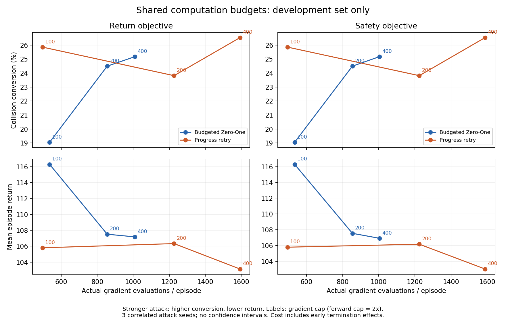

# 共享模型计算预算：开发集结果

2026-09-24。七批共 **1,650 个新增 episode 已全部完成**，覆盖预先登记的完整网格。本轮仅增加汇总工具、测试和报告，没有修改攻击算法、训练入口、环境或冻结 checkpoint。

低档 100/200 下，进展版本在本开发集有较好的配对碰撞结果；中档 200/400 下则出现退化。结果支持进一步检验低预算行为搜索，尚不支持全面优于 Zero-One、独立计算效率提升或跨交通泛化的结论。这里的 Zero-One 特指采用相同资源计数和上限的 `zero_one_budgeted_*` 对照。

## 范围与审计

- 协议：[SHARED_COMPUTE_BUDGET_PROTOCOL.md](SHARED_COMPUTE_BUDGET_PROTOCOL.md)；配置清单：`configs/research/shared_compute_budget_sweep.json`。
- 五个 Clean checkpoint，attack seeds 0/1/2，同一 development split 10 的十个交通 episode，每个最多 200 步。梯度/forward 上限为 100/200、200/400、400/800；其余预算、扰动包络、搜索时域与停止规则固定。
- 六批低档新增 1,500 episode，高档 seed 0 Zero-One 同源码补录新增 150 episode。其余高档复用已审计记录。七批新运行均来自 `d1c5fa9156e52480caad25d90e1fc0555d138e7a`。
- 逐步审计共 **274,744 个新增真实交互步**；七批 Clean 回归共 69,804 步一致，每批 9,972 步。排除 wall time 后核对动作、观测、奖励、终止和记录字段；数值 seed、模型哈希、运行源码、环境版本及预算差异均通过既有逐批审计。
- 汇总重新核对原始输入哈希和高档引用报告哈希，拒绝不完整网格、重复档位/seed、缺失模型、不同交通、不同 checkpoint 或不一致高档引用；36 个“预算×攻击种子×方法/目标”单元完整。
- Python 3.7.16、Torch 1.3.1+cpu、NumPy 1.21.6、SUMO 1.22.0。完整版本、启动命令、配置、seed、源码与权重哈希保存在各运行 manifest；未改变 legacy 环境依赖。
- 88 项单元测试通过。图表已渲染检查。汇总代码 SHA：`4ef1143`；机器摘要：[SHARED_COMPUTE_BUDGET_RESULTS.json](SHARED_COMPUTE_BUDGET_RESULTS.json)。原始逐步记录仍只保存在 `.local/`。

## 碰撞与回报

下表每格分别汇总三个攻击 seed，每种方法/目标共 150 次运行。它们重复使用同一组模型和交通，并非 150 个独立场景。Clean 每个 seed 是 1/50 碰撞、平均回报 141.555519；合并后有 147 个 Clean 未碰撞的配对记录，作为 collision-conversion ASR 的分母。Return 与 Safety 分别计算，下表碰撞计数恰好相同，不把两目标合并扩大样本。

| 梯度/forward 上限 | 方法 | 碰撞 / 150 | 新增碰撞 / 147 | ASR | Return 目标平均回报 | Safety 目标平均回报 |
| --- | --- | ---: | ---: | ---: | ---: | ---: |
| 100/200 | Zero-One | 31 | 28 | 19.05% | 116.3089 | 116.2950 |
| 100/200 | 进展版本 | 41 | 38 | 25.85% | 105.7976 | 105.7976 |
| 200/400 | Zero-One | 39 | 36 | 24.49% | 107.5089 | 107.5528 |
| 200/400 | 进展版本 | 38 | 35 | 23.81% | 106.3282 | 106.1759 |
| 400/800 | Zero-One | 40 | 37 | 25.17% | 107.1721 | 106.9233 |
| 400/800 | 进展版本 | 42 | 39 | 26.53% | 103.1269 | 103.0314 |

预算越低并不保证攻击越弱。两个上限一起改变，不能据此区分梯度上限和 forward 上限的独立作用。

| 上限 | Attack seed | Zero-One 碰撞 / 50 | 进展版本碰撞 / 50 |
| --- | ---: | ---: | ---: |
| 100/200 | 0 | 13 | 14 |
| 100/200 | 1 | 8 | 14 |
| 100/200 | 2 | 10 | 13 |
| 200/400 | 0 | 14 | 13 |
| 200/400 | 1 | 13 | 13 |
| 200/400 | 2 | 12 | 12 |
| 400/800 | 0 | 14 | 14 |
| 400/800 | 1 | 13 | 14 |
| 400/800 | 2 | 13 | 14 |

每个目标的逐 episode 配对结果：100 档进展版本独有碰撞 11、Zero-One 独有碰撞 1；200 档分别为 2、3；400 档分别为 2、0。所有不一致案例的 episode、交通 seed、步数、回报差和计算差都保留在机器摘要中。

相对同方法的 400 档，100 档进展版本新增碰撞 0、丢失 1；Zero-One 新增 2、丢失 11。200 档进展版本新增 0、丢失 4；Zero-One 新增 1、丢失 2。这些是配对记录计数，不是单独抽样的统计试验。

## 实际成本与候选覆盖

下表为每种方法/目标 150 episode 的实际成本总量；shadow 包含规划中的新转移、replay 和 reset 预热。每组 episode 初始 oracle setup 的 12,300 shadow 步另计。并行 wall time 不用作算法速度证据。

| 上限 | 方法 / 目标 | 梯度 | Forward | 规划 shadow steps |
| --- | --- | ---: | ---: | ---: |
| 100/200 | Zero-One / Return | 80,222 | 250,606 | 175,655 |
| 100/200 | 进展 / Return | 74,312 | 235,047 | 167,303 |
| 100/200 | Zero-One / Safety | 80,176 | 250,413 | 175,186 |
| 100/200 | 进展 / Safety | 74,312 | 235,047 | 167,303 |
| 200/400 | Zero-One / Return | 128,288 | 355,954 | 241,396 |
| 200/400 | 进展 / Return | 184,044 | 473,094 | 251,751 |
| 200/400 | Zero-One / Safety | 128,144 | 355,459 | 239,696 |
| 200/400 | 进展 / Safety | 183,666 | 471,907 | 249,898 |
| 400/800 | Zero-One / Return | 151,444 | 418,929 | 368,358 |
| 400/800 | 进展 / Return | 239,086 | 605,928 | 412,529 |
| 400/800 | Zero-One / Safety | 150,666 | 416,564 | 361,671 |
| 400/800 | 进展 / Safety | 238,300 | 603,561 | 408,671 |

100 档 Return 进展版本总梯度少 7.37%、forward 少 6.21%、规划 shadow 少 4.75%。但真实交互步也从 Zero-One 的 25,097 降为 23,260：梯度/真实交互步分别为 3.1965 与 3.1948，forward/步分别为 9.9855 与 10.1052。此归一化仍对应不同状态和轨迹，只用于揭示提前终止的影响，不能当作相同任务工作量下的因果效率测量。200、400 档进展版本的三项实际总成本均高于对照。



横轴为每 episode 平均实际梯度调用，点旁为每规划块梯度上限；forward 上限是其两倍。线仅连接预登记的三个档位，不表示连续插值实验。三个攻击 seed、两个目标存在相关性，图中不绘制独立样本置信区间。

Return 目标的规划覆盖如下；Safety 全量统计见机器摘要。完整搜索候选不包括 Clean fallback，可含重复实际行为序列。被选中的搜索候选也不一定实施了非零扰动。

| 上限 | 方法 | 规划块 | 完整搜索候选 | 候选/块 | 不完整候选 | 选完整 Clean fallback 的块 |
| --- | --- | ---: | ---: | ---: | ---: | ---: |
| 100/200 | Zero-One | 1,273 | 1,958 | 1.54 | 1,269 | 947 |
| 100/200 | 进展 | 1,193 | 1,266 | 1.06 | 1,193 | 822 |
| 200/400 | Zero-One | 1,186 | 10,043 | 8.47 | 275 | 836 |
| 200/400 | 进展 | 1,195 | 5,265 | 4.41 | 1,046 | 817 |
| 400/800 | Zero-One | 1,182 | 11,693 | 9.89 | 70 | 831 |
| 400/800 | 进展 | 1,163 | 10,721 | 9.22 | 280 | 804 |

全网格没有“零完整搜索候选”的规划块，没有 unplanned fallback，也没有未验证 live fallback。不完整候选没有进入评分和执行。因此观察到的低档差异不能解释为某方法完全没有可执行计划；低档下候选覆盖显著减少，但候选数量本身也不等于攻击效果。

## 关键案例、重复性与负结果

此前两个额外碰撞都仍能被低档进展版本触发，但“相对 Zero-One 独有”并未全部保留。两目标均如此：

| 案例（checkpoint 均为 2） | 上限 | Zero-One | 进展版本 |
| --- | --- | --- | --- |
| attack seed 1 / episode 5 / SUMO 2018177452 | 400/800 | 无碰撞，200 步 | 碰撞，42 步 |
| 同上 | 200/400 | 碰撞，41 步 | 碰撞，41 步 |
| 同上 | 100/200 | 碰撞，41 步 | 碰撞，41 步 |
| attack seed 2 / episode 9 / SUMO 1828089188 | 400/800 | 无碰撞，200 步 | 碰撞，33 步 |
| 同上 | 200/400 | 无碰撞，200 步 | 碰撞，48 步 |
| 同上 | 100/200 | 碰撞，29 步 | 碰撞，45 步 |

100 档每个目标的 11 个进展独有碰撞中，**7 个来自同一 episode 3 / SUMO 1610385403**：attack seed 1 的 checkpoint 0/1/3/4，以及 attack seed 2 的 checkpoint 0/1/4。均在第一个交互步终止。其余 4 个是 checkpoint 2 的不同配对记录。因而低档优势确实不只出现在 checkpoint 2，但主要的跨模型收益重复使用了同一个交通情形，不能据此宣称跨场景泛化。

抽查 seed 1/checkpoint 0/episode 3 的原始记录：Clean 和低档 Zero-One 首动作为 2，无碰撞；进展首动作为 1，SUMO 报告 ego collision 并终止。进展选择的候选在 oracle 中已经以同动作、同奖励 0 和碰撞正常终止，是完整候选；Zero-One 的完整候选首动作仍为 2，另有一个未完成候选被排除。记录来自 `20260923T151742067057Z-attack-benchmark/run-0/clean-seed0-{none,zero_one_budgeted_return,ours_progress_return}/steps.jsonl`，哈希已纳入审计。这说明此例不是拿不完整 rollout 的低回报充当成功攻击。

同样需要保留反例：100 档 attack seed 2/checkpoint 2/episode 8，Zero-One 在 119 步碰撞，进展运行到 200 步仍无碰撞。200 档 checkpoint 2/episode 4 在三个攻击 seed 上均为 Zero-One 碰撞、进展无碰撞；进展在另两个配对记录的收益不足以抵消这一退化。不能根据最终总数删除这些记录或重新选择档位。

所有碰撞沿用原 SUMO 配置，可能包含 minGap 语义，不能解释为已经验证车身接触。TTC/DRAC 仍只覆盖 step 后同车道前后邻车；碰撞后 ego 不在仿真中的样本无可用邻车指标，不补造 TTC。此报告不据此提出横向安全或物理可行性的新增主张。

## 可复现命令与下一步

在仓库根目录、干净工作区运行下列命令可重新生成机器摘要和图。需保留本地原始记录及报告；克隆仓库不会获得 `.local/` 数据。输出放在忽略目录，随后人工审阅并将必要小型摘要复制到 docs。

```powershell
$env:PATH="$PWD\.local\envs\oarl-legacy;$PWD\.local\envs\oarl-legacy\Library\bin;$env:PATH"
$env:MPLCONFIGDIR="$PWD\.local\matplotlib-tests"
$budgetBatches = @(
  '20260923T142718092754Z-attack-benchmark',
  '20260923T144010942398Z-attack-benchmark',
  '20260923T145508212119Z-attack-benchmark',
  '20260923T150836143706Z-attack-benchmark',
  '20260923T151742067057Z-attack-benchmark',
  '20260923T152747531873Z-attack-benchmark'
)
$budgetReports = @($budgetBatches | ForEach-Object { ".local/runs/$_/verified-budget-summary.json" })
& .local/envs/oarl-legacy/python.exe scripts/summarize_budget_sweep.py --reports $budgetReports --output .local/shared-compute-budget-results.json --figure .local/shared-compute-budget-curve.png
```

本轮解决了开发集三档预算下的效果–成本测量和配对核验。下一步适合冻结当前候选，在既定 **validation split 20 的新交通**上预登记并复核完整三档网格，尤其检查低档优势是否仍依赖单一首步碰撞情形、中档 episode 4 类退化是否重现。不应只挑开发集表现最好的档位来宣称全面优势。final split 30 保留到参数锁定后一次性测试。

目前不需要新增算法模块或凭此结果调整停止阈值。若下一轮仍有收益，再针对自身新增模块设计明确消融；本次敏感性实验没有单独识别进展停止规则的贡献，也没有与低档 v0 作模块归因比较。验证与最终测试本轮均未执行。

当前分支 `feat/shared-compute-budget-sweep`。本阶段提交包括 `b6ec155`（固定网格）、`91a1b4d`（预算与回退审计）、`d1c5fa9`（预登记协议）、`167ad09`（汇总与针对性测试）、`4ef1143`（图表标签修正）。未创建稳定方法 milestone tag。
