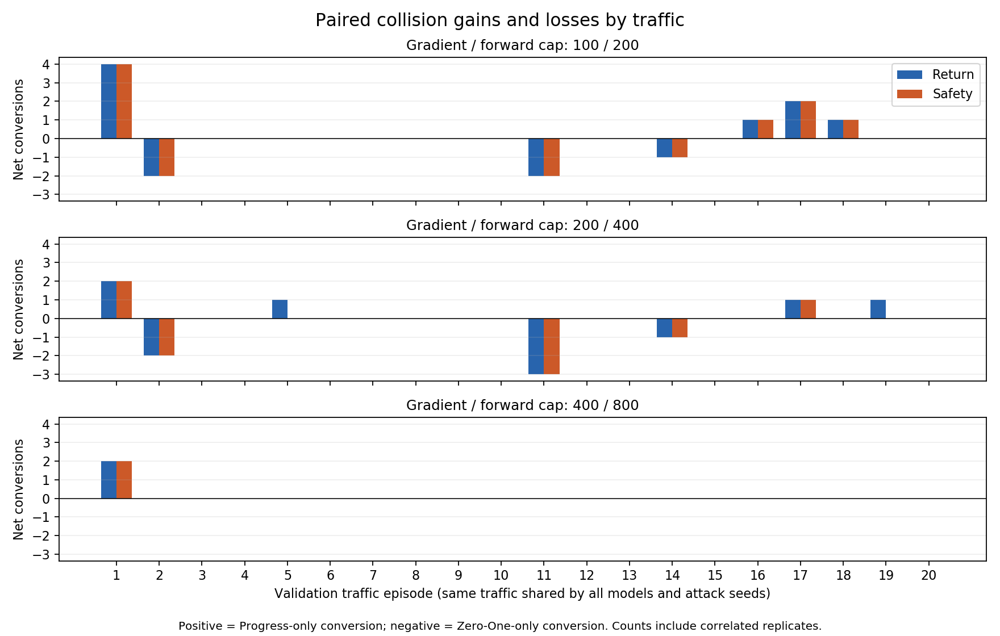
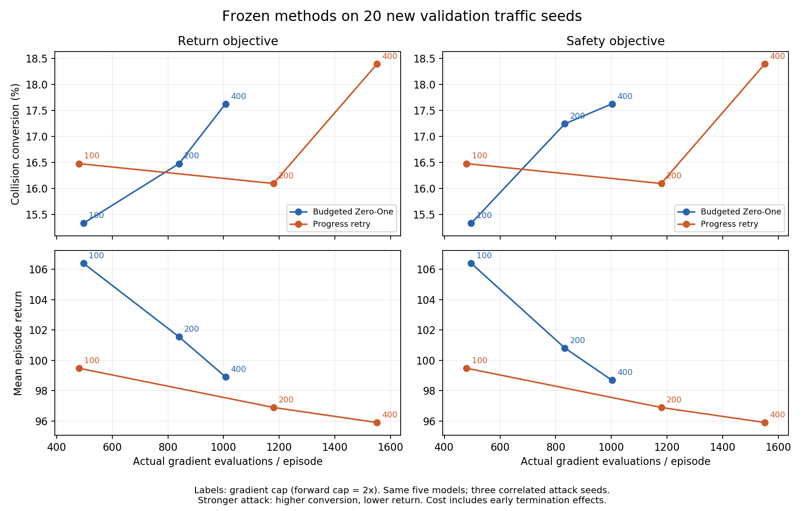

# 共享计算预算：新交通验证结果

2026-09-25。**九批、4,500 episode 全部完成，707,039 个交互步通过审计。** 当前证据不足以支持“进展版本具有稳定的碰撞优势”：100/200 档净增 3 个配对碰撞，但去掉一个交通 seed 后净差变为 −1；200/400 档退化；400/800 档净增 2 个碰撞均来自同一交通，并需要更多模型计算。本轮保持算法冻结，没有依据验证结果调整参数，也未使用 final split 30。

协议：[SHARED_COMPUTE_VALIDATION_PROTOCOL.md](SHARED_COMPUTE_VALIDATION_PROTOCOL.md)。完整机器摘要：[SHARED_COMPUTE_VALIDATION_RESULTS.json](SHARED_COMPUTE_VALIDATION_RESULTS.json)。以下 Zero-One 均指同资源账本与上限下的 `zero_one_budgeted_*` 对照。

## 完成范围与可复现性

- 同一 SUMO 场景、五个冻结 episode-400 Clean Victim；validation split 20 的 20 个新交通 seed、attack seeds 0/1/2、200 步上限。三档梯度/forward 上限 100/200、200/400、400/800；其余扰动、搜索、仿真和终止条件均冻结。
- 九批实验和逐批审计均来自 `782ceb9bc8ee12f9b05b18d250f7dc792ff9a10d`。运行源码与开发冻结点 `57ae7e8` 一致，Python 3.7.16、Torch 1.3.1+cpu、NumPy 1.21.6、SUMO 1.22.0 通过原环境校验，所有 checkpoint 哈希一致。
- 3,600 个攻击 episode，900 个重复 Clean 控制。Clean 仅有 100 个唯一模型–交通组合，不能按 900 个独立样本解释。首次 Clean 参考共 18,027 步；其余八批的 144,216 步回归一致。
- 顶层运行记录：`.local/runs/20260925-shared-compute-validation/validation.json`。九批原始输入、配置、种子、命令、代码快照和版本保留在各 batch 下；没有提交 raw trajectories、checkpoint 或日志。
- 汇总重新核对全部审计报告及原始输入哈希，确认网格、模型、traffic、Clean 轨迹和 episode 配对完整，重算配对计数与交通集中性。完整运行均来自同一提交；汇总脚本来自 `a943c5a`。
- **96 项测试通过**，包括遗漏/重复网格拒绝、交通错配拒绝、排除 Clean 自身碰撞、保留零贡献交通，以及逐一排除交通的净差计算。两张图已渲染检查。

## 碰撞、ASR 与回报

Clean 在 100 个唯一模型–交通组合中有 13 个碰撞，平均回报 127.355352。每方法/目标/预算合并三个相关攻击 seed 后有 300 条记录，其中 Clean 未碰撞的配对分母为 **261 = 87×3**。ASR 是其中的碰撞转换比例，不把 Clean 自身碰撞算作攻击成功。低档的“82/300 对 79/300”不能直接当作“82 次对 79 次攻击成功”。

| 梯度/forward | 方法 | 目标 | 碰撞 / 300 | 转换 / 261 | ASR | 平均回报 |
| --- | --- | --- | ---: | ---: | ---: | ---: |
| 100/200 | Zero-One | Return | 79 | 40 | 15.33% | 106.3927 |
| 100/200 | 进展 | Return | 82 | 43 | 16.48% | 99.4823 |
| 100/200 | Zero-One | Safety | 79 | 40 | 15.33% | 106.3927 |
| 100/200 | 进展 | Safety | 82 | 43 | 16.48% | 99.4823 |
| 200/400 | Zero-One | Return | 82 | 43 | 16.48% | 101.5471 |
| 200/400 | 进展 | Return | 81 | 42 | 16.09% | 96.8983 |
| 200/400 | Zero-One | Safety | 84 | 45 | 17.24% | 100.8115 |
| 200/400 | 进展 | Safety | 81 | 42 | 16.09% | 96.8983 |
| 400/800 | Zero-One | Return | 85 | 46 | 17.62% | 98.9132 |
| 400/800 | 进展 | Return | 87 | 48 | 18.39% | 95.9087 |
| 400/800 | Zero-One | Safety | 85 | 46 | 17.62% | 98.6893 |
| 400/800 | 进展 | Safety | 87 | 48 | 18.39% | 95.9087 |

进展版本的平均回报在各档都更低，但中档碰撞更少，说明回报损害和碰撞目标并不一致。各条件的 Return Drop、攻击率、动作改变率、扰动范数与安全指标保留在机器摘要的逐模型 `summary`；分位数只保留原采样范围，不将不同 episode 的 TTC/DRAC 分位数平均后冒充 pooled 分位数。

每个 attack seed 的碰撞计数如下（每格分母 100）。两个进展目标的计数相同；Zero-One 在中档 seed 0 的目标差异必须保留。

| 上限 | Attack seed | Zero-One Return | Zero-One Safety | 进展 Return/Safety |
| --- | ---: | ---: | ---: | ---: |
| 100/200 | 0 | 27 | 27 | 28 |
| 100/200 | 1 | 26 | 26 | 27 |
| 100/200 | 2 | 26 | 26 | 27 |
| 200/400 | 0 | 27 | 29 | 27 |
| 200/400 | 1 | 28 | 28 | 27 |
| 200/400 | 2 | 27 | 27 | 27 |
| 400/800 | 0 | 29 | 29 | 29 |
| 400/800 | 1 | 29 | 29 | 29 |
| 400/800 | 2 | 27 | 27 | 29 |

## 配对得失与交通集中性

“进展独有 / Zero-One 独有”表示同 checkpoint、交通、attack seed 下只有一方碰撞。本轮这些不一致记录均来自 Clean 未碰撞的条件，因而也对应独有转换。每行计数合计 300。

| 上限 / 目标 | 进展独有 | Zero-One 独有 | 共同碰撞 | 共同未碰撞 | 转换净差 | 去掉任一交通后的净差范围 |
| --- | ---: | ---: | ---: | ---: | ---: | --- |
| 100/200 / Return | 8 | 5 | 74 | 213 | +3 | −1 至 +5 |
| 100/200 / Safety | 8 | 5 | 74 | 213 | +3 | −1 至 +5 |
| 200/400 / Return | 5 | 6 | 76 | 213 | −1 | −3 至 +2 |
| 200/400 / Safety | 3 | 6 | 78 | 213 | −3 | −5 至 0 |
| 400/800 / Return | 2 | 0 | 85 | 213 | +2 | 0 至 +2 |
| 400/800 / Safety | 2 | 0 | 85 | 213 | +2 | 0 至 +2 |



逐一去掉交通的检查按预登记执行，整组去掉同交通下全部模型和攻击 seed；未以有利结果选择剔除对象，也未用它替代主结果。净差范围是描述性稳健性检查，不是独立样本置信区间、显著性检验或算法模块消融。

低档的 8 个进展独有转换分布在 episode 1、16、17、18；5 个 Zero-One 独有转换分布在 episode 2、11、14。

- **episode 1 / SUMO 66220013**：低档贡献 +4，来自 attack seeds 1/2 × checkpoint 0/4，进展均在第 3 步碰撞，对照均运行到 200 步未碰撞。去掉此交通后净差为 **−1/246**。高档的全部 +2 也来自此交通的 attack seed 2 × checkpoint 0/4。
- **episode 11 / SUMO 1394101652**：中档在 checkpoint 2 的三个攻击 seed 上均为进展无碰撞、Zero-One 碰撞，贡献 −3；低档贡献 −2。中档 seed 1/2 的 Zero-One 第 4 步碰撞，进展均完成 200 步。
- 低档其余进展独有案例：checkpoint 2，seed 0 的 episode 17/18（93/69 步碰撞）、seed 1 的 episode 17（58 步）、seed 2 的 episode 16（34 步）。
- 低档其余漏检：checkpoint 2，seed 0 的 episode 14（对照 56 步碰撞）；seed 1/2 的 episode 2（对照均 62 步碰撞）。全部不一致配对的回报与成本差保留在摘要中。

开发集的首步独有碰撞模式没有直接重现：本次每个预算/目标下，两方法的**独有转换中均无一步即终止的碰撞**。这不代表验证中没有首步碰撞；例如低档全部碰撞中，进展有 30 条一步终止记录、Zero-One 有 26 条。它们与独有转换是不同统计对象，不能混用。低档主要净收益现在集中于另一个第 3 步碰撞的交通，仍不足以说明收益广泛分布。

低档按 checkpoint 合并三个攻击 seed（每行每方法 60 episode，两目标相同）：

| Checkpoint seed | Zero-One 碰撞 | 进展碰撞 | 净差 |
| --- | ---: | ---: | ---: |
| 0 | 7 | 9 | +2 |
| 1 | 6 | 6 | 0 |
| 2 | 53 | 52 | −1 |
| 3 | 6 | 6 | 0 |
| 4 | 7 | 9 | +2 |

收益不只出现在 checkpoint 2，但 checkpoint 0/4 的增加共享同一交通；checkpoint 2 反而净减 1。中档负结果也不是只由平均分母变化造成，存在明确的逐 episode 漏检。

## 实际成本与完整候选

下表每行合并 300 episode。规划 shadow 包括新转移、replay 和 reset 预热；初始 oracle setup 每行另有 24,600 shadow 步，完整账本均经审计。

| 上限 | 方法 / 目标 | 梯度 | Forward | 规划 shadow |
| --- | --- | ---: | ---: | ---: |
| 100/200 | Zero-One / 两目标分别 | 148,922 | 467,949 | 350,171 |
| 100/200 | 进展 / 两目标分别 | 143,986 | 457,739 | 341,456 |
| 200/400 | Zero-One / Return | 251,982 | 706,497 | 522,853 |
| 200/400 | Zero-One / Safety | 249,886 | 699,383 | 504,901 |
| 200/400 | 进展 / 两目标分别 | 353,810 | 917,648 | 535,518 |
| 400/800 | Zero-One / Return | 302,048 | 844,172 | 827,556 |
| 400/800 | Zero-One / Safety | 300,714 | 839,995 | 819,197 |
| 400/800 | 进展 / 两目标分别 | 465,288 | 1,183,869 | 827,895 |

低档进展版本总梯度少 3.31%、forward 少 2.18%、规划 shadow 少 2.49%，真实交互步也从 46,671 降至 45,469。每交互步梯度分别为 Zero-One 3.1909、进展 3.1667，forward 分别为 10.0265、10.0671。这仍不是同轨迹、同状态工作量下的因果效率测量。中档进展实际梯度高约 40%–42%，高档高约 54%–55%，不能由较低回报直接推导成本效率优势。



Return 目标完整候选与回退统计如下；Safety 单独保存在摘要中。候选可重复实际行为；选择搜索候选也不等于实施非零扰动。

| 上限 | 方法 | 规划块 | 完整搜索候选 | 不完整候选 | 选完整 Clean fallback 的块 |
| --- | --- | ---: | ---: | ---: | ---: |
| 100/200 | Zero-One | 2,388 | 3,801 | 2,361 | 1,742 |
| 100/200 | 进展 | 2,332 | 2,557 | 2,317 | 1,623 |
| 200/400 | Zero-One | 2,341 | 19,329 | 603 | 1,609 |
| 200/400 | 进展 | 2,331 | 10,459 | 1,970 | 1,544 |
| 400/800 | Zero-One | 2,312 | 22,796 | 188 | 1,593 |
| 400/800 | 进展 | 2,277 | 20,931 | 564 | 1,550 |

全网格无“零完整搜索候选”的块、unplanned fallback 或未验证 live fallback，不完整候选没有进入评分或执行。覆盖下降是真实的预算效应，但不能只凭完整候选总数解释碰撞得失。

相对同方法高档的配对碰撞转换：100 档 Zero-One 两目标各新增 0、丢失 6，进展各新增 0、丢失 5；200 档 Zero-One Return 新增 0、丢失 3，Safety 新增 0、丢失 1，进展两目标各新增 0、丢失 6。没有省略非单调结果：进展中档比低档少 1 个碰撞。

## 结论边界与下一步

验证支持的有限观察是：低档三个攻击 seed 各有一个净增碰撞、平均回报更低且总调用量略少。验证同时表明：净碰撞优势对一个交通高度敏感；中档主安全指标退化且计算更多；高档额外碰撞也集中于一个交通。不能据此认定已满足稳定安全收益、独立效率收益或论文创新的要求。

保持以下边界：同一场景和同一组模型，仅 traffic 是新的；多个目标、模型和攻击 seed 相关，不当作独立试验；SUMO 碰撞可能包括 minGap 事件，不声称车身接触；TTC/DRAC 的同车道前后邻车采样不覆盖完整横向风险。低回报不等价于更多安全事故。

下一步建议先分析已有轨迹中的 **episode 11 漏检** 与 **episode 1 三步碰撞**，区分搜索未覆盖有效行为、内层诱导失败、停止重试或候选评分造成的差异，再决定是否修订方法或将当前版本作为负结果保留。对照分析本身不能单独证明某模块因果有效，若修改新增模块需另分支、明确假设并独立消融。

**本轮不推进 final test，也不通过更换验证 seed 或临时调预算来追求正结果。** split 20 的结果现已被查看，若今后据此改方法，必须明确这是验证驱动开发，不能继续把同一验证集当未见数据。最终 split 30 仍保留至候选与分析规则锁定之后。

## 复现汇总

在保留本地原始记录的干净工作区执行；无需重跑 SUMO：

```powershell
$env:PATH="$PWD\.local\envs\oarl-legacy;$PWD\.local\envs\oarl-legacy\Library\bin;$env:PATH"
$env:MPLCONFIGDIR="$PWD\.local\matplotlib-tests"
& .local/envs/oarl-legacy/python.exe scripts/summarize_budget_validation.py --pipeline .local/runs/20260925-shared-compute-validation/validation.json --output .local/shared-compute-validation-results.json --figures .local/validation-figures
```

分支 `feat/shared-compute-validation`。准备提交为 `31b1a96`（配置）、`7e5a8ca`（审计）、`a9d5b5f`（顺序运行器）、`782ceb9`（预登记和实验冻结点）；本轮增加 `a943c5a`（完整汇总、集中性检查及测试）。没有修改攻击实现、checkpoint 或两个上游项目源码，也未创建稳定方法 tag。
