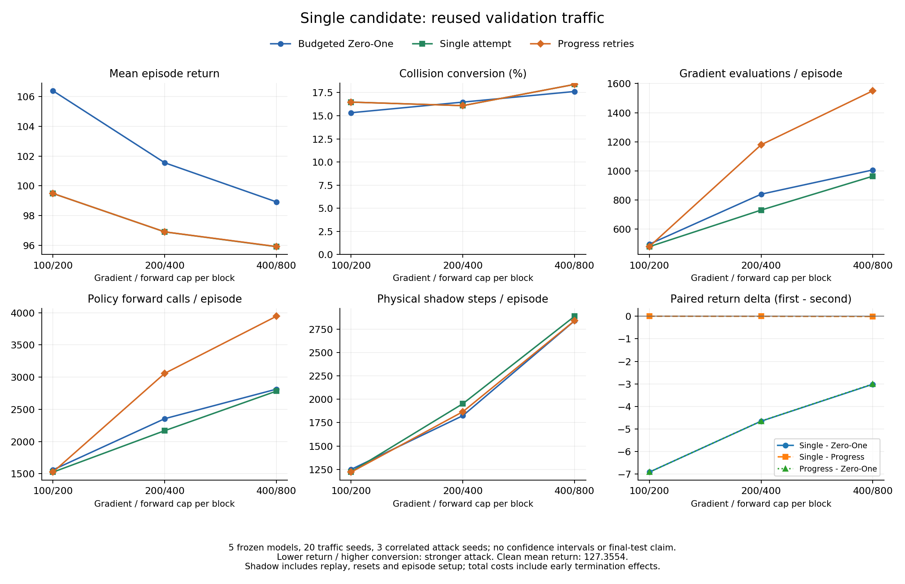

# Single 简化候选：验证结果与成本取舍

2026-10-03。九批新增 **1800 episode / 297467 个交互步**全部通过审计；复用的两个 Return 对照共 1800 episode / 272619 步再次核验。Single 与 Progress 的 **900 对碰撞结果逐对一致**，中、高预算档少用约 38% 梯度，仿真成本有所增加。Single 相对预算版 Zero-One 的三档平均回报更低，但安全收益仍小且集中，不能据此声称稳定的碰撞优势。

协议：[SINGLE_CANDIDATE_VALIDATION_PROTOCOL.md](SINGLE_CANDIDATE_VALIDATION_PROTOCOL.md)。机器摘要：[SINGLE_CANDIDATE_VALIDATION_RESULTS.json](SINGLE_CANDIDATE_VALIDATION_RESULTS.json)。原机制研究、原验证和简单攻击对照分别见 [MECHANISM_DEVELOPMENT_RESULTS.md](MECHANISM_DEVELOPMENT_RESULTS.md)、[SHARED_COMPUTE_VALIDATION_RESULTS.md](SHARED_COMPUTE_VALIDATION_RESULTS.md)、[VALIDATION_COMPARISON_RESULTS.md](VALIDATION_COMPARISON_RESULTS.md)。

## 执行范围与来源

- 独立分支 `codex/single-candidate-validation` 从 `main` 的 `aac4716fd7d535920f667eabde8af749b2360245` 创建。复用既有 `SingleAttemptAttack`，固定 `max_attempts=1`；本轮没有修改攻击运行源码、上游 OARL、SUMO 环境或 checkpoint。
- 五个冻结 episode-400 Clean 模型，split 20 的二十个共同交通 seed，attack seed 0/1/2，200 步上限，三档梯度/forward 上限 100/200、200/400、400/800。Return、horizon 20、十个搜索候选、PGD 两步、步长 1、`|delta_i| <= 0.2|obs_i|+0.05` 及仿真权限均沿用原协议。无 Gate。
- 新增 Clean、Single 各 900 episode，执行源码固定为 `4ada57b940a04edfd6a450627a60b23b67a5fb67`，期间 tracked tree 干净。45 个配置、审计器、汇总器和测试在运行前提交。2026-10-03 07:49:27–08:39:22 UTC 完成；并行 wall time 不用于速度比较。
- 原 Zero-One Return、Progress Return 各 900 episode 来自 `782ceb9bc8ee12f9b05b18d250f7dc792ff9a10d`。协议冻结其审计、配置、原始数据和执行来源哈希；49 个既有运行文件不变，仅两个注册/配置文件增加 Single 支持，另有一个既有包装器。每批再次检查运行版本、参数、角色 seed、checkpoint 和原始输入。复用数据没有重新命名为本轮执行。
- 新 Clean 的 **162243 步**与对应旧 Clean 完整回归一致；三方法共同首次尝试的 seed、实际动作、margin 一致。原 Progress−Zero-One 的 **45 个模型条件**配对统计重新核验完全一致。所有扰动边界、预算账本、完整计划及冻结权重检查通过，没有未规划或未核验的执行回退。
- Python 3.7.16，Torch 1.3.1+cpu（线程 1），NumPy 1.21.6，SciPy 1.7.3，sklearn 0.24.2，SUMO 1.22.0，Windows 11。五个文件/权重哈希和完整版本清单保留在 manifest，文件哈希也写入机器摘要。没有更新环境依赖。
- **125 项测试通过**，覆盖原功能、完整网格拒绝、二十交通的相关重复分组、新增/复用来源检查和启动器计数/失败中止。共用汇总工具的默认十交通结果及旧图表重新构建一致；新图表已渲染检查。

比较表共有 3600 条条件记录。每档每方法的 300 条记录仅来自 **100 个 model/traffic 单元、20 个交通 seed**的三次相关攻击，跨预算也复用同一交通。旧 Clean 只用于回归，不加入另一套分母。split 20 先前已用于判断方法，因此本轮属于**验证驱动的候选复核**；final split 30 未使用，没有未见测试或显著性结论。

顶层运行记录：`.local/runs/20261003-single-candidate-validation/candidate-validation.json`。完整审计路径、输入哈希、命令、种子、原始轨迹及代码快照由该文件和机器摘要追溯。raw、日志、模型和源快照继续留在忽略的 `.local/`。

## 回报与碰撞

Clean 平均回报 127.355352，100 个唯一模型–交通单元中 13 个碰撞；按三个 attack seed 重复后为 39/300。ASR 分母是 Clean 未碰撞的 **261 = 87×3** 条配对记录，SUMO 碰撞包含原 minGap 语义，不等同于几何接触。TTC/DRAC 保持原纵向采样范围，本轮不增加安全指标主张。

| 梯度/forward | Return 方法 | 平均回报 | 碰撞 / 300 | 转换 / 261 | ASR |
| --- | --- | ---: | ---: | ---: | ---: |
| 100/200 | Zero-One | 106.392653 | 79 | 40 | 15.33% |
| 100/200 | Single | 99.482283 | 82 | 43 | 16.48% |
| 100/200 | Progress | 99.482283 | 82 | 43 | 16.48% |
| 200/400 | Zero-One | 101.547067 | 82 | 43 | 16.48% |
| 200/400 | Single | 96.894883 | 81 | 42 | 16.09% |
| 200/400 | Progress | 96.898266 | 81 | 42 | 16.09% |
| 400/800 | Zero-One | 98.913168 | 85 | 46 | 17.62% |
| 400/800 | Single | 95.899068 | 87 | 48 | 18.39% |
| 400/800 | Progress | 95.908702 | 87 | 48 | 18.39% |

Single 三档每个 attack seed 的碰撞数依次为 28/27/27、27/27/27、29/29/29，每格 100 episode。与 Progress 的逐 episode 碰撞结果全部相同，并非只有总数相同。

| Single−Zero-One | 配对平均 Return 差 | Single 独有 / ZO 独有转换 | 净差 | 移除任一交通后的净差范围 | 模型 Return 胜/平/负 | 交通 Return 胜/平/负 |
| --- | ---: | ---: | ---: | --- | --- | --- |
| 100/200 | −6.910370 | 8 / 5 | +3 | −1 至 +5 | 5/0/0 | 15/1/4 |
| 200/400 | −4.652184 | 5 / 6 | −1 | −3 至 +2 | 5/0/0 | 16/1/3 |
| 400/800 | −3.014100 | 2 / 0 | +2 | 0 至 +2 | 4/0/1 | 16/1/3 |

Return 胜指均值更低，数值相等阈值固定为 `1e-9`。移除任一交通后，三档 Return 差范围分别为 [−7.638694, −4.892071]、[−5.647871, −3.554577]、[−3.426275, −1.935038]，方向均保留；高档 checkpoint 3 的平均 Return 差仍为 **+0.443981**，不能写成所有模型都胜。

碰撞集中性没有因简化而消失：低档去掉 episode 1 后净差为 −1；中档 checkpoint 2 的净差 −3，其中 episode 11 的三个 attack seed 均漏检；高档的全部 +2 仍来自 episode 1 的 checkpoint 0/4、attack seed 2。分组移除是描述性稳健性检查，不是模块消融或独立样本置信区间。

## 实际计算成本

下表为每档每方法 300 episode 的合计。模型调用均为攻击搜索账本，不含评估循环本身每步两次 policy forward；后者在逐 episode 原始记录中单列。Physical shadow 包含新 transition、历史 replay、reset 预热和 episode setup，不含真实环境交互步；各攻击每档 setup 均为 24615 步，机器摘要单列。

| 梯度/forward | 方法 | 梯度次数 | 攻击 Policy forward | 新 shadow transition | Physical shadow（含 setup） |
| --- | --- | ---: | ---: | ---: | ---: |
| 100/200 | Zero-One | 148922 | 467949 | 61549 | 374786 |
| 100/200 | Single | 143810 | 457473 | 62301 | 367287 |
| 100/200 | Progress | 143986 | 457739 | 62254 | 366071 |
| 200/400 | Zero-One | 251982 | 706497 | 79383 | 547468 |
| 200/400 | Single | 219240 | 650615 | 84245 | 585906 |
| 200/400 | Progress | 353810 | 917648 | 83357 | 560133 |
| 400/800 | Zero-One | 302048 | 844172 | 100375 | 852171 |
| 400/800 | Single | 289128 | 834998 | 109341 | 866726 |
| 400/800 | Progress | 465288 | 1183869 | 107382 | 852510 |

相对 Progress，Single 的中、高档梯度减少 **38.03% / 37.86%**，forward 减少 **29.10% / 29.47%**，physical shadow 增加 **4.60% / 1.67%**；低档梯度只减少 0.12%，shadow 增加 0.33%。相对 Zero-One，Single 三档梯度减少 3.43%/12.99%/4.28%，forward 减少 2.24%/7.91%/1.09%，physical shadow 变化为 −2.00%/+7.02%/+1.71%。不存在全面资源优势，也未给梯度与仿真成本任意加权成单个分数。

Single−Progress 的配对平均 Return 差为 0、−0.003383、−0.009633，碰撞转换净差均为 0；实际轨迹一致数为 **300/300、295/300、287/300**。中、高档的模型计算节省与几乎一致的执行结果同时出现，支持本次简化的取舍，但极小 Return 差不宜当作效果突破：高档移除 episode 13 后差变为 **+0.001965**。

候选重复也没有自动解决：中档 Single 完整搜索候选 18039 条，其中实际序列重复 14341 条；高档为 21371 / 15674。重复候选会命中缓存，重复比例不能当作物理查询浪费比例。共同缓存本来就存在于预算版 Zero-One，Single−ZO 是外层搜索组织的联合比较，不单独证明缓存创新。



## 正反轨迹证据

机器摘要保留每档每比较的两个极端 model/traffic 单元，共 18 个案例及原轨迹路径。单元先合并三个 attack seed，再选择绝对差最大的 seed 展示，不以个别有利轨迹替代整网格。

- **简化有收益但不是新增转换**：高档 checkpoint 2 / episode 13 / SUMO 2021711356 / attack seed 0，Single 与 Progress 在零起算第 2 步、相同观测上选动作 0/2；Single 在第 5 步碰撞，Progress 在第 13 步碰撞，Return 差 −3.449956。Clean 自身已碰撞，所以该例**不进入攻击成功分母**。其三个 seed 合并贡献 −1.149985，是高档微小 Return 优势的主要来源；移除此交通，均值方向翻转。
- **简化确实会丢失成功诱导**：中档 checkpoint 0 / episode 14 / SUMO 2125771701 / attack seed 0，零起算第 161 步，目标 1 的首次尝试 seed 3229283294 实际为 2、margin −0.009795，两方法一致。Progress 的第二次尝试 seed 1005844225 实际命中 1、margin +0.079783，Single 已停止尝试而执行 2；两者均运行 200 步无碰撞，Single Return 高 0.1。不能把“单次失败”写成“动作不可达”。
- **高档负例保留**：checkpoint 4 / episode 17 / SUMO 615847619，三个 attack seed 的 Single Return 都比 Progress 高 0.187518；代表 seed 0 在零起算第 3 步首次分歧为动作 2/1。Progress 首块有 42 次重试，选择的计划也不同；该分歧处共同首次证据一致，不能把效果差直接归因于该步新增成功重试。两者均 200 步无碰撞，Single 全 episode 少用 938 次梯度。
- **有限预算下计划选择改变**：中档 checkpoint 2 / episode 3 / SUMO 533300723 / attack seed 2，零起算第 60 步 Single 选候选 5、动作 2，Progress 选候选 1、动作 1；首次证据一致，Progress 对目标 0 后续两次仍失败。最终均碰撞，Single 提前两步，Return 差 −0.900692。该例说明重试与后续计划覆盖同时变化，不能隔离为单一因果模块。

## 本轮选择与后续范围

建议**将 Single Return 冻结为下一轮正式比较候选**，同时保留 Progress 作为机制参考。依据是本次验证保留了 Progress 的逐 episode 碰撞结果，模型计算显著减少，而非预设所有重试无用。前轮开发集高档 Single 平均 Return 曾比 Progress 高 0.359890，不能用本轮微小均值改善抹去这个取舍；有效后续尝试的反例也继续保留。

原简单攻击比较无需覆写：本轮 Single 的三档 ASR 与原 Progress 相同，仍为 16.48%/16.09%/18.39%；FGSM 的既有 16.09% 对照及其来源保持原样。高档相对 FGSM 的额外转换仍集中于 checkpoint 2 的两个交通。当前可支持的研究主张是**实际行为搜索的回报损害与模型计算分配取舍**，尚不支持稳定安全提升、跨场景泛化或全面超过基线。论文创新仍须围绕外层机制及已有工作边界论证，不能把共用缓存、PGD 或本轮验证包装成新贡献。

下一项功能应独立预登记最终未见交通上的候选与全套对照协议，保留三档预算、实际资源账本和负例；最终结果不可反过来调参。该协议与运行需独立 branch，本轮没有启动 final split 30、Safety 简化候选、PPO、场景扩展或防御开发，也没有重新训练 victim。先确认正式攻击结论，再决定论文主张和防御范围。

## 提交与重建

| Commit | 原子修改 |
| --- | --- |
| `9696aee` | 冻结候选协议、45 配置和复用来源 |
| `df18c49` | 新增候选/旧对照审计与共同首次尝试检查 |
| `96fa84d` | 接入有界并发批量运行，区分新增 episode 计数 |
| `4ada57b` | 汇总二十交通、配对成本及图表；125 项测试通过 |

```powershell
$env:PATH="$PWD\.local\envs\oarl-legacy;$PWD\.local\envs\oarl-legacy\Library\bin;$env:PATH"
$env:OMP_NUM_THREADS='1'
$env:MKL_NUM_THREADS='1'
$env:MPLCONFIGDIR="$PWD\.local\matplotlib-tests"
$env:PYTHONWARNINGS='ignore'
& .local/envs/oarl-legacy/python.exe scripts/summarize_single_validation.py --pipeline .local/runs/20261003-single-candidate-validation/candidate-validation.json --output .local/runs/20261003-single-candidate-validation/rebuilt-summary.json --figure .local/runs/20261003-single-candidate-validation/rebuilt-figure.png
```

重建时工作区需干净，输出使用新的忽略路径；统计内容应相同，`summary_commit` 随当前 Git 提交变化。新实验必须使用新的输出目录，不覆盖本轮顶层运行与审计记录。结果提交并验证后，本功能按 `--no-ff` 合入 `main`，保留分支和来源 SHA；本轮不创建 milestone tag 或公开 push。
