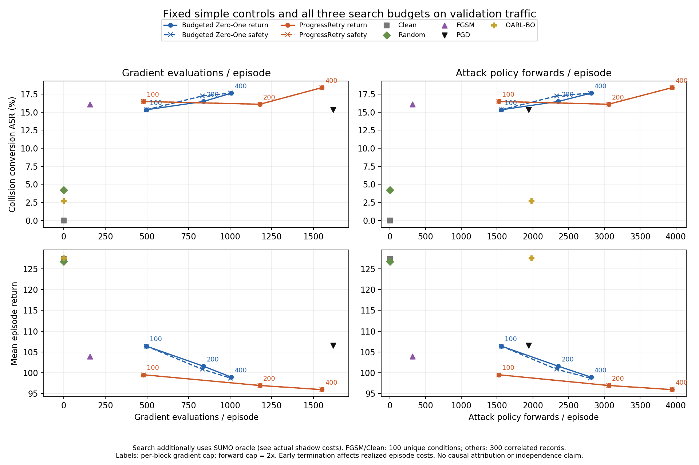

# 同验证交通的完整攻击比较

2026-10-01。三批新增 **1,300 episode、225,248 真实交互步全部审计通过**；五模型的三批Clean逐步回归一致。完整17行效果、成本、六组核心搜索配对、十二组搜索对FGSM配对已补齐。搜索方法保持既有三档结果，final split 30未使用。本轮不修改算法、上游代码或冻结模型。

主要结论：轨迹搜索能进一步降低回报，高档有有限的额外碰撞转换，但当前证据不足以支持其具有稳定、广泛的安全收益或全面成本优势。相对预算版Zero-One的核心结论保持原样，不能由新增简单对照替代。

完整表格：[VALIDATION_COMPARISON_TABLES.md](VALIDATION_COMPARISON_TABLES.md)。机器摘要：[VALIDATION_COMPARISON_RESULTS.json](VALIDATION_COMPARISON_RESULTS.json)。预登记：[BASIC_VALIDATION_COMPARISON_PROTOCOL.md](BASIC_VALIDATION_COMPARISON_PROTOCOL.md)。原搜索验证：[SHARED_COMPUTE_VALIDATION_RESULTS.md](SHARED_COMPUTE_VALIDATION_RESULTS.md)。以下Zero-One均指预算版，原`zero_one`适配版没有混入本轮。

## 问题一：轨迹搜索相对简单攻击是否值得开销

同五个Clean Victim、validation split 20的20个交通seed、200步上限及greedy策略。Random/PGD/BO各使用attack seeds 0/1/2；FGSM确定性，只执行一次。所有方法无Gate，共同观测扰动盒相同；内层目标与访问权限按既有实现固定。OARL-BO为盒内共享仿射子集，在线包装继续使用`obs2=obs1`。

| 方法 | N | Return | Drop | 碰撞 | 碰撞转换ASR |
| --- | ---: | ---: | ---: | --- | --- |
| Clean | 100 | 127.3554 | 0 | 13/100 | 0/87（控制） |
| Random | 300 | 126.8122 | 0.5431 | 44/300 | 11/261 = 4.21% |
| FGSM | 100 | 103.9251 | 23.4302 | 26/100 | 14/87 = 16.09% |
| PGD | 300 | 106.5105 | 20.8448 | 69/300 | 40/261 = 15.33% |
| OARL-BO | 300 | 127.5966 | −0.2413 | 40/300 | 7/261 = 2.68% |
| 当前Return/Safety，100/200 | 300 | 99.4823 | 27.8731 | 82/300 | 43/261 = 16.48% |
| 当前Return/Safety，200/400 | 300 | 96.8983 | 30.4571 | 81/300 | 42/261 = 16.09% |
| 当前Return/Safety，400/800 | 300 | 95.9087 | 31.4467 | 87/300 | 48/261 = 18.39% |

ASR仅将配对Clean未碰撞的episode作为分母。原始碰撞包括Clean自身容易碰撞的交通，不能等同于攻击成功。每个方法最多100个唯一模型–交通组合，三个攻击seed是相关重复；FGSM参考复用于搜索配对不增加样本数。Return/Safety分行保留在17行总表；上表合并相同数值仅便于阅读，不代表独立重复证据。

FGSM是本轮简单方法中ASR最高者，且平均回报低于PGD。当前方法相对FGSM的平均回报差在三档分别为−4.4429、−7.0269、−8.0164；碰撞转换净增只有+1、0、+6条相关配对记录。高档+6全部来自**checkpoint 2 × episode 2/18 × 三个attack seed**，即两种交通、一个模型；对应SUMO seeds为1408038459和625261628。其他四模型的ASR与FGSM相同。去掉一个交通后的高档净差范围为[3,6]，但这不是模型泛化或置信区间。

| 条件 | 梯度/episode | 攻击Forward/episode | 真实Shadow步/episode（含setup） |
| --- | ---: | ---: | ---: |
| FGSM | 158.04 | 316.08 | 0 |
| PGD | 1618.20 | 1941.84 | 0 |
| OARL-BO | 0 | 1983.48 | 0 |
| 当前100/200 | 479.95 | 1525.80 | 1220.24 |
| 当前200/400 | 1179.37 | 3058.83 | 1867.11 |
| 当前400/800 | 1550.96 | 3946.23 | 2841.70 |

因此不能笼统称搜索全面更贵：低档当前方法比固定10步PGD使用更少梯度和Forward，同时回报更低，但多用了SUMO仿真。相对更便宜的FGSM，高档当前方法约使用9.81倍梯度、12.48倍攻击Forward并增加仿真，只换来2.30个百分点ASR和8.02回报损害；安全增益又集中于一个模型。若重视回报损害，存在可讨论的取舍；若重视广泛碰撞诱导与计算效率，尚不能认定开销值得。各资源没有预先定义共同价格，不能把它们压成任意加权的总效率排名。

Random效果较弱；在线OARL-BO对Clean策略的动作改变率只有0.57%，平均回报未降低。该结果仅描述这个固定在线包装与模型，不能否定原OARL训练内BO鲁棒约束或完整算法。更低的Return不自动意味着更大的安全损害。

不同简单攻击与搜索的目标、信息权限不同；搜索额外拥有SUMO oracle。因此本问题回答的是现有固定协议的效果–成本取舍，**不是仿真搜索模块的因果消融**。

## 问题二：当前方法是否优于预算版Zero-One

两搜索方法共享同预算执行器、仿真权限、目标控制及三档上限。以下独有转换只统计Clean未碰撞的配对。完整六行包含实际Forward、梯度、新转移、Shadow差，见总表与JSON。

| 梯度/Forward上限 | 目标 | 当前独有转换 | Zero-One独有转换 | 净差/261 | Return差（当前−对照） | 当前梯度成本变化 | 去掉一交通净差范围 |
| --- | --- | ---: | ---: | ---: | ---: | ---: | --- |
| 100/200 | Return | 8 | 5 | +3 | −6.9104 | −3.31% | [−1,5] |
| 100/200 | Safety | 8 | 5 | +3 | −6.9104 | −3.31% | [−1,5] |
| 200/400 | Return | 5 | 6 | −1 | −4.6488 | +40.41% | [−3,2] |
| 200/400 | Safety | 3 | 6 | −3 | −3.9132 | +41.59% | [−5,0] |
| 400/800 | Return | 2 | 0 | +2 | −3.0045 | +54.04% | [0,2] |
| 400/800 | Safety | 2 | 0 | +2 | −2.7806 | +54.73% | [0,2] |

当前方法所有档位的回报更低；中档安全效果退化，高档只有2条额外转换，且均来自同一个交通episode 1。高档攻击Forward增加40.24%/40.94%，实际Shadow含setup增加0.04%/1.03%；没有全面成本优势。低档较低总成本包含提前终止的影响，不能单独当成搜索效率改善。两个当前目标的结果一致，没有显示Safety目标的额外收益。

新增简单对照没有改变这个核心判断：**回报均值更低，碰撞优势小且不稳定，计算成本没有全面优势**。目前不支持“稳定优于预算版Zero-One”的论文主张。

## 费用、指标及复现记录



图包含全部三档和两个目标。纵轴分别是ASR与Return，横轴分别是实际梯度、攻击Forward/episode；Shadow成本另表报告，不能由图中的横坐标推断总费用。没有加无依据的误差条、独立性或显著性声明。

- 新实验与审计：`84c3a5fae38ce7a704a4cb66335e08c698fbba66`；搜索原实验：`782ceb9bc8ee12f9b05b18d250f7dc792ff9a10d`；汇总脚本：`06e11d5cf52deac5fc9686dd37539fedbd62004b`。JSON保存输入哈希、模型哈希、交通seed、协议哈希与全部17行。
- 环境：Python3.7.16、PyTorch1.3.1+cpu、NumPy1.21.6、SUMO1.22.0，与既有搜索的冻结manifest逐项一致。主启动器为系统Python3.12.7；SUMO实验与数字审计使用legacy环境。
- 新增1,000个攻击episode及300个Clean回归控制；FGSM100，Random/PGD/BO各300。Clean100个唯一条件，重复回归共54,081步，均与搜索参考一致。原始轨迹、checkpoint、日志均留在忽略目录`.local/`。搜索原4,500episode被引用，不重复运行或重新选参数。
- Pipeline：`.local/runs/20261001-basic-validation-controls/basic-validation.json`。三批原始步数依次85,489、69,623、70,136。逐步检查随机seed、扰动界、成本、回报、动作、碰撞/终止、首次动作分歧前的配对前缀及BO候选；正式汇总再次校验所有输入SHA并复算搜索汇总。
- 104项测试通过；图已渲染检查。测试覆盖网格遗漏/重复、FGSM伪重复拒绝、Clean ASR分母、按episode/真实步计费、setup计入Shadow，以及Clean无归一化扰动范数时保留null。
- TTC/DRAC保留逐checkpoint/attack seed的原采样摘要；同车道前后车、交互后采样，缺少闭合样本的TTC为null。没有将各组分位数平均成总体分位数，没有以搜索内部目标分数替代真实指标。SUMO碰撞仍包含minGap语义。BO最大归一化扰动1.000001来自原float32仿射计算，处于既有逐特征绝对容差2e−7内；没有为了汇总重新裁剪扰动。

复现配置与批量启动命令见预登记。已完成的pipeline有固定输入哈希；重跑应使用新输出目录并从相应实验commit启动。生成本轮正式表的命令为：

```powershell
$env:PATH="$PWD\.local\envs\oarl-legacy;$PWD\.local\envs\oarl-legacy\Library\bin;$env:PATH"
$env:OMP_NUM_THREADS='1'
$env:MKL_NUM_THREADS='1'
$env:MPLCONFIGDIR="$PWD\.local\matplotlib-tests"
& .local/envs/oarl-legacy/python.exe scripts/summarize_validation_comparison.py `
  --pipeline .local/runs/20261001-basic-validation-controls/basic-validation.json `
  --output .local/VALIDATION_COMPARISON_RESULTS.json `
  --markdown .local/VALIDATION_COMPARISON_RESULTS.md `
  --figures .local/comparison-figures
```

汇总要求Git工作区干净，并重新确认原始文件哈希；在其他干净commit重算时`summary_commit`按当前SHA更新。生成的表格、数值与当前受审计数据应一致。

## 后续研究决策

本轮比较工作完成，候选方法的稳定安全收益尚未建立。下一步先用已有日志诊断三类反例：当前方法在episode 11错失Zero-One碰撞、高档相对Zero-One的收益为何局限episode 1、相对FGSM的收益为何只在checkpoint 2的episode 2/18。区分诱导失败、重试分配、候选筛选与早终止带来的统计变化，先写可验证机制假设，再决定是否修改方法。

split20已经用于判断，未来据此改算法应标明验证驱动开发，final split30继续保留。暂不以新增消融或更换环境/victim替代核心负结果，不创建算法有效性里程碑tag。
